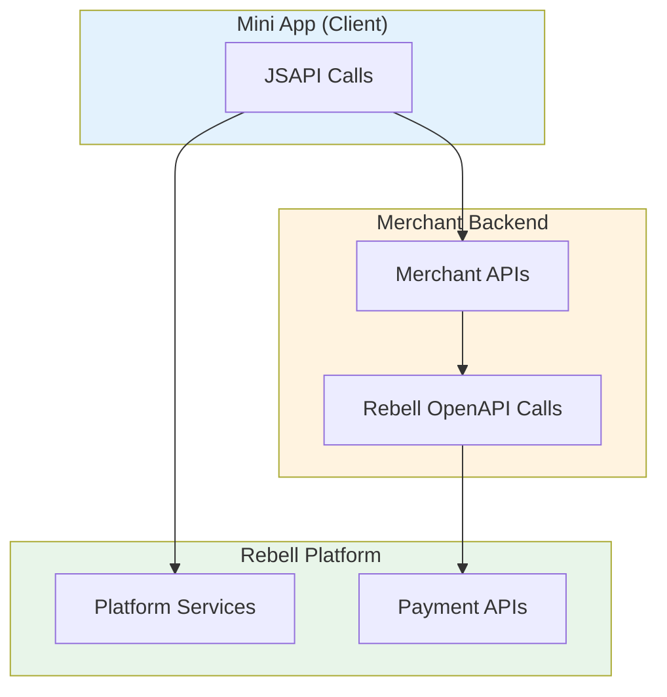
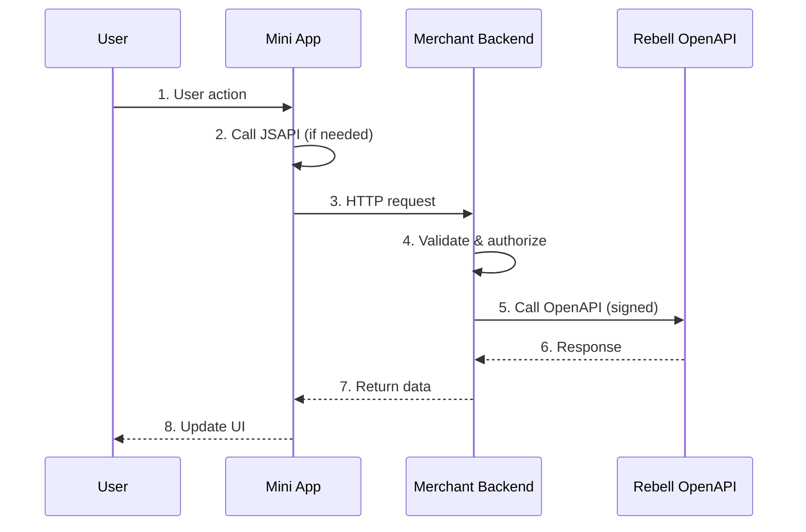
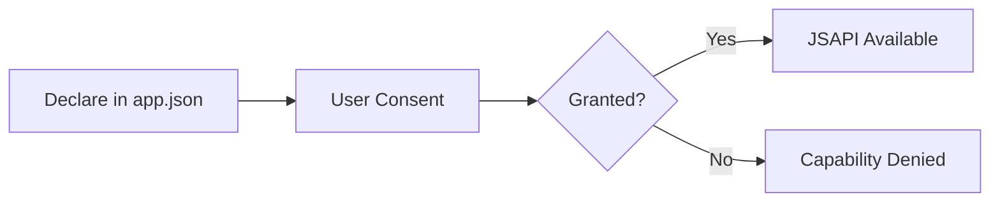

Mini Apps interact with the Rebell platform and merchant systems through a well-defined set of APIs.

These APIs are designed to enable user interaction, platform integration, and secure communication with merchant backends while enforcing strict security boundaries.

## API Model Overview

Mini App APIs are divided into two main categories:

<CardGroup cols={2}>
  <Card title="Client-Side APIs (JSAPI)" icon="mobile-screen">
    APIs exposed to Mini App code running inside the SuperApp
  </Card>
  <Card title="Server-Side APIs (OpenAPI)" icon="server">
    Server-to-server APIs consumed by merchant backends
  </Card>
</CardGroup>

Each category has a distinct role and must be used according to its scope and security constraints.



## Client-Side APIs (JSAPI)

**JSAPI** are APIs exposed to Mini App code running inside the Rebell SuperApp.

They allow the Mini App to:

- Interact with the **SuperApp runtime**
- Control **navigation** and UI behavior
- Access **platform capabilities**
- Trigger **user-facing actions** such as payments

JSAPI are invoked directly from Mini App JavaScript code and execute within the platform-controlled sandbox.

### Key Characteristics

| Characteristic | Description |
|----------------|-------------|
| **Execution** | Inside Mini App runtime only |
| **Security** | No access to merchant secrets or credentials |
| **Permissions** | Subject to capability restrictions |
| **Context** | User-context aware |

### Common JSAPI Categories

<Tabs>
  <Tab title="Navigation">
    Control page navigation within the Mini App:

    ```javascript
    // Navigate to a new page
    my.navigateTo({
      url: '/pages/detail/detail?id=123'
    });

    // Go back to previous page
    my.navigateBack();

    // Switch to a tab page
    my.switchTab({
      url: '/pages/home/home'
    });
    ```
  </Tab>

  <Tab title="UI & Feedback">
    Display dialogs, toasts, and loading indicators:

    ```javascript
    // Show toast message
    my.showToast({
      content: 'Operation successful',
      type: 'success'
    });

    // Show loading indicator
    my.showLoading({
      content: 'Loading...'
    });

    // Show confirmation dialog
    my.confirm({
      title: 'Confirm',
      content: 'Are you sure?',
      success: (result) => {
        if (result.confirm) {
          // User confirmed
        }
      }
    });
    ```
  </Tab>

  <Tab title="Network">
    Make HTTP requests to merchant backend:

    ```javascript
    // Make API request
    my.request({
      url: 'https://api.merchant.com/orders',
      method: 'POST',
      data: { productId: '123' },
      headers: {
        'Content-Type': 'application/json'
      },
      success: (res) => {
        console.log(res.data);
      },
      fail: (err) => {
        console.error(err);
      }
    });
    ```
  </Tab>

  <Tab title="Storage">
    Local data storage (limited, non-sensitive):

    ```javascript
    // Store data
    my.setStorage({
      key: 'userPreferences',
      data: { theme: 'dark' }
    });

    // Retrieve data
    my.getStorage({
      key: 'userPreferences',
      success: (res) => {
        console.log(res.data);
      }
    });
    ```
  </Tab>
</Tabs>

### Authorization JSAPI

Request user authorization for scoped data access:

```javascript
// Request user authorization
my.getAuthCode({
  scopes: ['auth_user'],
  success: (res) => {
    const authCode = res.authCode;
    // Send authCode to backend for exchange
    sendToBackend(authCode);
  },
  fail: (err) => {
    console.error('Authorization denied');
  }
});
```

<Warning>
The `authCode` returned is a **short-lived, single-use** token. It must be exchanged server-side — never validated client-side.
</Warning>

### Payment JSAPI

Trigger payment flows from the Mini App:

```javascript
// Trigger payment UI
my.tradePay({
  tradeNO: 'payment_reference_from_backend',
  success: (res) => {
    if (res.resultCode === '9000') {
      // Payment successful - but wait for backend confirmation!
      checkPaymentStatus();
    }
  },
  fail: (err) => {
    // Payment failed or cancelled
    handlePaymentError(err);
  }
});
```

<Warning>
**Important:** JSAPI payment results are **indicative only**. Always confirm payment status via backend webhook before updating business state.
</Warning>

## Server-Side APIs (OpenAPI)

**OpenAPI** refers to server-to-server APIs exposed by Rebell and consumed by merchant backends.

They are used to:

- Execute **secure operations**
- Manage **payments and transactions**
- Retrieve or update **backend data**
- Receive **asynchronous notifications**

### Key Characteristics

| Characteristic | Description |
|----------------|-------------|
| **Authentication** | Requires request signing |
| **Execution** | Outside Mini App runtime |
| **Security** | Subject to rate limiting and security policies |
| **Invocation** | From merchant backend systems only |

<Warning>
OpenAPI calls **must never** be made directly from Mini App code.
</Warning>

### Common OpenAPI Categories

<Tabs>
  <Tab title="Authentication">
    Exchange authorization codes for user context:

    ```javascript
    // Backend: Exchange authCode for user info
    const response = await rebellClient.post('/v1/miniapp/auth/token', {
      grantType: 'authorization_code',
      code: authCode
    });

    const { userId, accessToken, scopes } = response.data;
    ```
  </Tab>

  <Tab title="User Info">
    Retrieve authorized user information:

    ```javascript
    // Backend: Get user profile (requires scope)
    const response = await rebellClient.post('/v1/miniapp/user/info', {
      accessToken: accessToken
    });

    const { userId, nickname, avatar } = response.data;
    ```
  </Tab>

  <Tab title="Payments">
    Create payments for Mini App flows:

    ```javascript
    // Backend: Create payment
    const response = await rebellClient.post('/v1/payments/linkPayCreate', {
      paymentRequestId: generateUniqueId(),
      order: {
        orderDescription: 'Product purchase',
        orderAmount: {
          value: '1000',
          currency: 'EUR'
        }
      },
      paymentNotifyUrl: 'https://merchant.com/webhooks/payment'
    });

    const { paymentId, paymentUrl } = response.data;
    ```
  </Tab>
</Tabs>

## Typical API Interaction Pattern

Mini Apps do not operate in isolation. Most real-world flows involve **both JSAPI and OpenAPI**, coordinated through the merchant backend.



This pattern ensures:

- **Sensitive operations** remain server-side
- **Payments** are securely authorized
- **Asynchronous events** are handled reliably

## API Scope & Responsibility

| API Type | Executed By | Purpose |
|----------|-------------|---------|
| **JSAPI** | Mini App runtime | UI, navigation, platform capabilities |
| **Merchant APIs** | Merchant backend | Business logic, data management |
| **Rebell OpenAPI** | Merchant backend | Payments, platform services |

<Info>
Mini Apps should always delegate:
- Business logic
- Data persistence
- Payment confirmation

...to the merchant backend.
</Info>

## Payments and Mini App APIs

Payments initiated from Mini Apps follow the same principles as standalone payments:

<Steps>
  <Step title="Trigger">
    Mini App triggers the payment flow using **JSAPI**
  </Step>

  <Step title="Create">
    Merchant backend creates the payment using **OpenAPI**
  </Step>

  <Step title="Confirm">
    Final payment result is delivered via **webhook**
  </Step>

  <Step title="Update">
    Mini App UI is updated based on **backend state**
  </Step>
</Steps>

<Warning>
Mini Apps must **never**:

- Perform payment authorization locally
- Trust client-side payment results
- Bypass backend verification
</Warning>

## Permissions and Capability Control

Access to JSAPI capabilities may be:

| Access Level | Description |
|--------------|-------------|
| **Automatic** | Available to all Mini Apps |
| **Restricted** | Limited by Mini App type |
| **Approval Required** | Subject to review approval |

### Permission Request Flow



Rebell enforces:

- **Capability-level permissions**
- **Runtime security checks**
- **Compliance validation** during review

<Tip>
Developers should request only the capabilities required for their Mini App. Excessive permission requests may delay review approval.
</Tip>

## JSAPI Error Handling

All JSAPI calls should include error handling:

```javascript
my.request({
  url: 'https://api.merchant.com/data',
  success: (res) => {
    // Handle success
  },
  fail: (err) => {
    // Handle error
    switch (err.error) {
      case 11:
        console.error('No permission');
        break;
      case 12:
        console.error('Network error');
        break;
      case 13:
        console.error('User cancelled');
        break;
      default:
        console.error('Unknown error', err);
    }
  },
  complete: () => {
    // Always called (success or fail)
    my.hideLoading();
  }
});
```

### Common Error Codes

| Code | Meaning | Action |
|------|---------|--------|
| `11` | No permission | Request permission or inform user |
| `12` | Network error | Retry or show error message |
| `13` | User cancelled | Allow user to retry |
| `14` | Timeout | Retry with backoff |

## Best Practices

<AccordionGroup>
  <Accordion title="Always handle errors">
    Never assume JSAPI calls will succeed. Always provide error handlers and user feedback.
  </Accordion>

  <Accordion title="Don't trust client-side data">
    Always validate and verify data on the backend. Never trust values passed from the Mini App.
  </Accordion>

  <Accordion title="Use appropriate APIs">
    Use JSAPI for UI and user interaction. Use OpenAPI (via backend) for business operations.
  </Accordion>

  <Accordion title="Request minimal permissions">
    Only request the scopes and capabilities you actually need.
  </Accordion>

  <Accordion title="Handle offline gracefully">
    Design your Mini App to handle network failures gracefully with appropriate user feedback.
  </Accordion>
</AccordionGroup>

## Next Steps

With an understanding of Mini App APIs, proceed to implement secure backend authentication:

<CardGroup cols={2}>
  <Card title="Backend Authentication" icon="shield-halved" href="/mini-app/backend-authentication">
    Implement the authCode exchange flow
  </Card>
  <Card title="Payments in Mini Apps" icon="credit-card" href="/mini-app/payments">
    Integrate payment functionality
  </Card>
</CardGroup>
