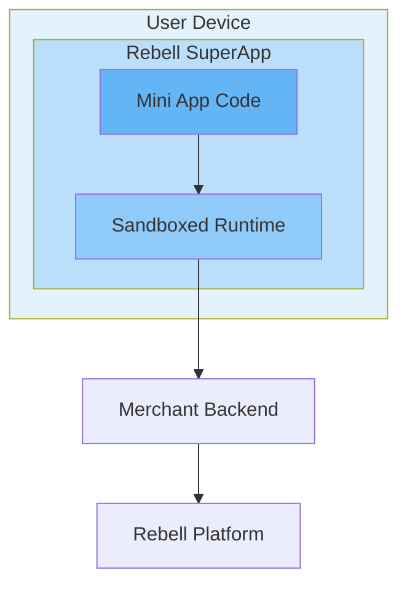
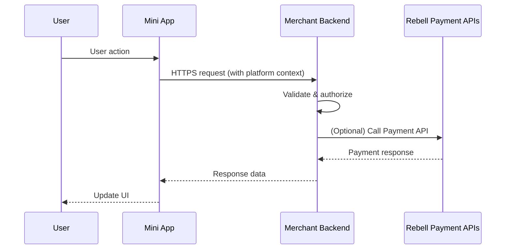
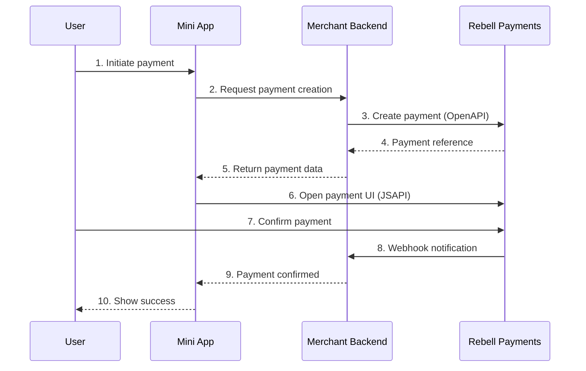

This section explains how Mini Apps are architected within the Rebell ecosystem, where code is executed, how security boundaries are enforced, and how Mini Apps interact with merchant backend systems and payments.

<Info>
Understanding these concepts is essential before starting development.
</Info>

## Execution Model

Mini Apps run inside the **Rebell SuperApp** and are executed by a **sandboxed runtime environment** provided by Rebell.

**Key characteristics:**

- Mini App code is **downloaded and executed at runtime**
- Execution happens **inside the SuperApp**, not on the merchant's infrastructure
- The runtime is **isolated** from the underlying mobile operating system
- Mini Apps **cannot access device resources** directly unless explicitly exposed by the platform

From a technical perspective, a Mini App behaves like a **managed frontend application**, not like a native app or a backend service.

## Separation of Responsibilities

A Mini App architecture always involves **three distinct layers**, each with a clear responsibility.

<Tabs>
  <Tab title="Mini App (Frontend)">
    **Responsible for:**

    - User interface and navigation
    - Capturing user input
    - Calling merchant backend APIs
    - Triggering platform capabilities (e.g., payments, navigation)

    **NOT responsible for:**

    - Business logic
    - Data persistence
    - Secrets or credentials
    - Payment authorization logic
  </Tab>

  <Tab title="Merchant Backend (Business)">
    **Responsible for:**

    - Business rules and workflows
    - Persistent data storage
    - Order management
    - Integration with Rebell Payment APIs
    - Security-sensitive operations

    <Warning>
    The merchant backend is **mandatory** for any production Mini App.
    </Warning>
  </Tab>

  <Tab title="Rebell Platform (Execution)">
    **Responsible for:**

    - Hosting and executing Mini Apps
    - Providing identity and session context
    - Exposing Mini App APIs (JSAPI)
    - Executing and securing payment flows
    - Enforcing security and compliance rules
  </Tab>
</Tabs>

### Responsibility Matrix

| Responsibility | Mini App | Merchant Backend | Rebell Platform |
|----------------|----------|------------------|-----------------|
| User interface | ✅ | | |
| Business logic | | ✅ | |
| Data persistence | | ✅ | |
| Payment creation | | ✅ | |
| Payment execution | | | ✅ |
| Identity & session | | | ✅ |
| Security enforcement | | | ✅ |

## Mini App Types: Native and H5

Rebell supports **two types** of Mini Apps, depending on how the user interface and user interactions are implemented.

Both types run inside the Rebell SuperApp and follow the same architectural and security principles.

<Tabs>
  <Tab title="Native Mini Apps">
    Native Mini Apps are built using the **Rebell Mini App framework** and platform-provided UI components.

    **Characteristics:**

    - User interface rendered using **platform-native components**
    - Deep integration with SuperApp navigation and capabilities
    - **Best performance** and responsiveness
    - Full access to Mini App APIs (JSAPI)
    - **Recommended** for most production use cases

    **Typical use cases:**

    - Interactive service flows
    - Payment-centric experiences
    - User journeys requiring native look and feel
    - Long-lived Mini Apps with frequent user interaction
  </Tab>

  <Tab title="H5 Mini Apps">
    H5 Mini Apps embed **web content** (HTML, CSS, and JavaScript) inside a Mini App container.

    **Characteristics:**

    - User interface rendered inside a **webview**
    - Faster migration from existing mobile web applications
    - **Limited access** to native Mini App capabilities
    - Performance dependent on web content and device

    **Typical use cases:**

    - Reusing existing mobile web services
    - Content-driven or informational experiences
    - Transitional solutions during native Mini App adoption
  </Tab>
</Tabs>

### Choosing the Right Type

| Criteria | Native Mini App | H5 Mini App |
|----------|-----------------|-------------|
| Performance | Excellent | Good |
| Native features | Full access | Limited |
| Development effort | Higher | Lower |
| Existing web assets | N/A | Can reuse |
| Recommended for | New integrations | Migration path |

<Tip>
**Native Mini Apps** are the recommended default for new integrations. **H5 Mini Apps** should be considered when rapid reuse of existing web assets is required.
</Tip>

Both Native and H5 Mini Apps rely on a merchant backend for business logic and payment execution, and both integrate with Rebell's payment platform using the same underlying principles.

## Security Boundaries

Mini Apps operate within **strict security boundaries**.

<Warning>
**Key security principles:**

- Mini Apps **cannot store secrets**
- Mini Apps **cannot directly call third-party services** without merchant backend mediation
- Mini Apps **cannot initiate payments independently** without platform involvement
- Network access is **restricted and controlled**
</Warning>

This model ensures:

<CardGroup cols={2}>
  <Card title="User Data Protection" icon="user-shield">
    Sensitive user information is isolated and controlled
  </Card>
  <Card title="Credential Protection" icon="key">
    Merchant credentials never touch client-side code
  </Card>
  <Card title="Regulatory Compliance" icon="scale-balanced">
    Financial regulations are enforced at the platform level
  </Card>
  <Card title="Reduced Attack Surface" icon="shield">
    Limited capabilities reduce potential vulnerabilities
  </Card>
</CardGroup>

<Info>
Any **sensitive operation** must be delegated to the merchant backend.
</Info>

## Communication Model

Mini Apps communicate with merchant systems using **HTTPS requests** to merchant-controlled endpoints.

**Important aspects:**

- Mini App requests are authenticated using **platform-provided context**
- Merchant backend **validates requests** and enforces authorization
- Merchant backend may call **Rebell Payment APIs** using server credentials
- Responses are returned to the Mini App for UI rendering

<Warning>
Mini Apps **never hold API keys or signing material**.
</Warning>

## Identity & User Context

When a Mini App is launched, Rebell provides a **user context** associated with the active SuperApp session.

This context allows the Mini App to:

- **Identify** the current user
- **Personalize** the experience
- **Associate actions** with a specific user account

However:

<AccordionGroup>
  <Accordion title="What the Mini App DOES receive">
    - Session context token
    - Authorization code for backend exchange
    - Platform-provided user identifier (after consent)
  </Accordion>

  <Accordion title="What the Mini App does NOT receive">
    - Raw user credentials
    - Long-lived tokens
    - Direct database access
  </Accordion>
</AccordionGroup>

<Info>
User identity is **mediated by the platform**. Long-term user data must be stored by the merchant backend.
</Info>

The exact APIs used to access identity information are described in the [Mini App APIs](/mini-app/apis) section.

## Payments in the Mini App Context

Payments inside Mini Apps follow the same principles as standalone payments, with an important distinction:

- The **payment experience is embedded** in the Mini App flow
- Payment execution is still handled by the **Rebell Payments Platform**
- Final payment confirmation is delivered via **backend webhooks**

<Warning>
Mini Apps **never bypass** backend validation or webhook confirmation.
</Warning>

## Architecture Summary

| Layer | Runs On | Responsibilities |
|-------|---------|------------------|
| Mini App | SuperApp runtime | UI, navigation, user input |
| Merchant Backend | Your servers | Business logic, data, payments |
| Rebell Platform | Rebell infrastructure | Execution, identity, security |

## Next Steps

With the architecture and concepts clarified, proceed to set up your development environment:

<CardGroup cols={2}>
  <Card title="Development Environment" icon="laptop-code" href="/mini-app/development-environment">
    Set up Mini Program Studio and configure your workspace
  </Card>
  <Card title="Mini App Lifecycle" icon="rotate" href="/mini-app/lifecycle">
    Understand the full lifecycle from creation to publishing
  </Card>
</CardGroup>
