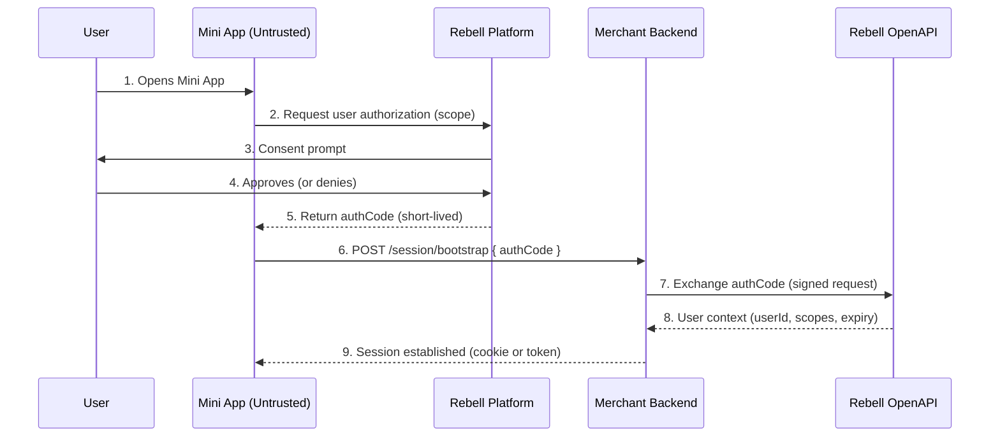
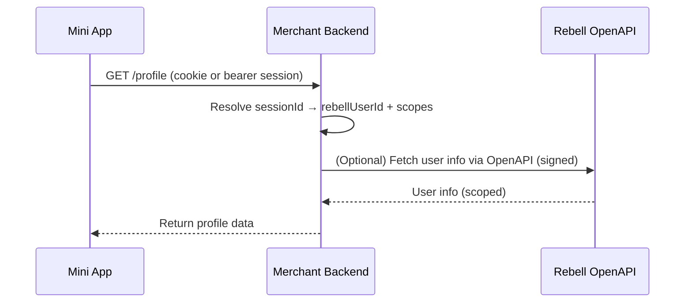
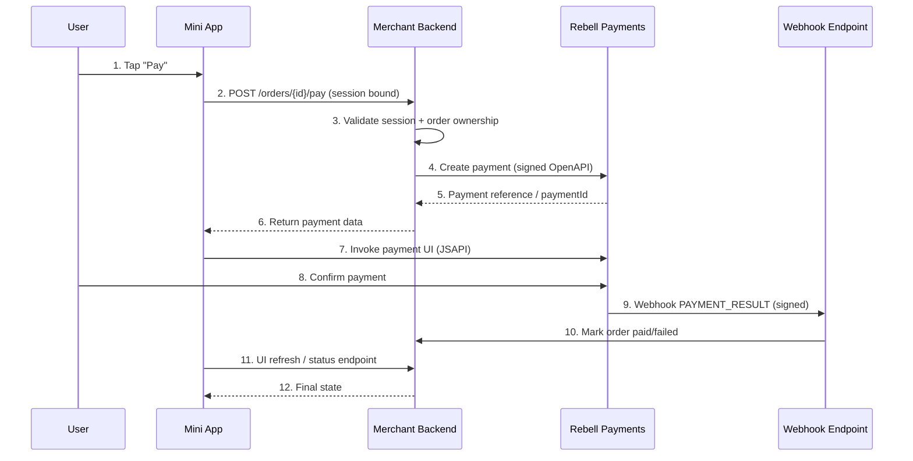

Mini Apps run inside the Rebell SuperApp but execute in a **client-side sandbox**. For security and compliance reasons, the Mini App must be treated as an **untrusted client**, and every call from the Mini App to the merchant backend must be authenticated and authorized.

This section describes the Rebell **authorization-code pattern** used to establish a trusted user context on the backend. This is the foundation for all other backend operations (orders, user profile access, payments, etc.).

## Trust Model Overview

### Actors

<CardGroup cols={2}>
  <Card title="User" icon="user">
    Rebell customer using the SuperApp
  </Card>
  <Card title="Mini App" icon="mobile-screen">
    Runs in Rebell SuperApp (**untrusted**)
  </Card>
  <Card title="Merchant Backend" icon="server">
    Trusted system of record
  </Card>
  <Card title="Rebell OpenAPI" icon="shield">
    Trusted authorization provider
  </Card>
</CardGroup>

### Key Rule

<Warning>
- The Mini App can **request** authorization and **carry** an authorization code, but it **cannot validate it**
- The Merchant Backend **must** exchange the code with Rebell OpenAPI to obtain a **trusted user context**
</Warning>

## Why Mini Apps Cannot Be Trusted

Mini Apps must not be trusted because:

| Risk | Description |
|------|-------------|
| **Environment** | They run on end-user devices (modifiable environment) |
| **Replay** | Requests can be replayed or forged |
| **Tampering** | User identity fields can be tampered with |
| **Secrets** | Secrets cannot be safely stored client-side |

<Warning>
**Therefore:**

- The backend must **never** trust `userId` or similar identifiers coming from the Mini App payload
- The backend **must** use server-side verification via Rebell OpenAPI
</Warning>

## Authorization Code (authCode) Concept

An `authCode` is a **short-lived, single-use** authorization artifact issued by Rebell after user consent.

### Properties

| Property | Description |
|----------|-------------|
| **Short-lived** | Expires quickly (typically minutes) |
| **Single-use** | Cannot be reused after exchange |
| **Bound** | Tied to user session, Mini App, and requested scopes |

### What authCode Is NOT

<Tabs>
  <Tab title="Not a long-lived token">
    The authCode expires quickly and cannot be stored for later use
  </Tab>
  <Tab title="Not an API key">
    It cannot be used to authenticate ongoing API calls
  </Tab>
  <Tab title="Not client-verifiable">
    The Mini App cannot cryptographically verify the authCode
  </Tab>
</Tabs>

### What authCode Is Used For

To let the Merchant Backend exchange it for a **trusted user context** (and optionally a platform access token / user identifiers, depending on scope).

## End-to-End Authorization Flow

### Sequence Diagram



### Flow Steps

<Steps>
  <Step title="Mini App Requests Authorization">
    Mini App calls JSAPI to request user authorization with specific scopes

    ```javascript
    my.getAuthCode({
      scopes: ['auth_user'],
      success: (res) => {
        const authCode = res.authCode;
        bootstrapSession(authCode);
      }
    });
    ```
  </Step>

  <Step title="User Grants Consent">
    Platform shows consent prompt; user approves or denies
  </Step>

  <Step title="Mini App Receives authCode">
    Platform returns short-lived, single-use authCode
  </Step>

  <Step title="Mini App Sends to Backend">
    Mini App sends authCode to merchant backend bootstrap endpoint
  </Step>

  <Step title="Backend Exchanges authCode">
    Backend exchanges authCode with Rebell OpenAPI (server-to-server, signed)
  </Step>

  <Step title="Backend Establishes Session">
    Backend creates internal session and returns session identifier to Mini App
  </Step>
</Steps>

### Result

The backend now has a **verified user context** and can securely act on behalf of that user, within granted scopes.

## Backend Token Exchange & Validation

### Exchange Step (Mandatory)

When the backend receives `authCode`, it must:

<Steps>
  <Step title="Validate Format">
    Validate basic format (non-empty, expected length)
  </Step>

  <Step title="Exchange with Rebell">
    Exchange it with Rebell OpenAPI (server-to-server, signed request)
  </Step>

  <Step title="Validate Response">
    Validate the response:
    - Mini App identifier (if provided)
    - Granted scopes match what is required
    - Token/user context is not expired
  </Step>

  <Step title="Create Session">
    Persist a backend session context
  </Step>
</Steps>

### Backend Exchange Implementation

<CodeGroup>

```javascript Node.js
app.post('/session/bootstrap', async (req, res) => {
  const { authCode, miniAppId, deviceId } = req.body;

  // 1. Validate authCode format
  if (!authCode || authCode.length < 10) {
    return res.status(400).json({ error: 'Invalid authCode' });
  }

  try {
    // 2. Exchange authCode with Rebell OpenAPI
    const rebellResponse = await rebellClient.post('/v1/miniapp/auth/token', {
      grantType: 'authorization_code',
      code: authCode
    });

    const { userId, accessToken, scopes, expiresIn } = rebellResponse.data;

    // 3. Validate scopes
    if (!scopes.includes('auth_user')) {
      return res.status(403).json({ error: 'Required scope not granted' });
    }

    // 4. Create backend session
    const session = await createSession({
      rebellUserId: userId,
      scopesGranted: scopes,
      expiresAt: Date.now() + expiresIn * 1000,
      miniAppId,
      deviceId
    });

    // 5. Return session to Mini App
    res.cookie('sessionId', session.id, {
      httpOnly: true,
      secure: true,
      sameSite: 'strict'
    });

    res.json({ success: true });

  } catch (error) {
    console.error('Auth exchange failed:', error);
    res.status(401).json({ error: 'Authorization failed' });
  }
});
```

```python Python (Flask)
@app.route('/session/bootstrap', methods=['POST'])
def bootstrap_session():
    data = request.get_json()
    auth_code = data.get('authCode')
    mini_app_id = data.get('miniAppId')
    device_id = data.get('deviceId')

    # 1. Validate authCode format
    if not auth_code or len(auth_code) < 10:
        return jsonify({'error': 'Invalid authCode'}), 400

    try:
        # 2. Exchange authCode with Rebell OpenAPI
        rebell_response = rebell_client.post('/v1/miniapp/auth/token', {
            'grantType': 'authorization_code',
            'code': auth_code
        })

        user_id = rebell_response['userId']
        scopes = rebell_response['scopes']
        expires_in = rebell_response['expiresIn']

        # 3. Validate scopes
        if 'auth_user' not in scopes:
            return jsonify({'error': 'Required scope not granted'}), 403

        # 4. Create backend session
        session = create_session(
            rebell_user_id=user_id,
            scopes_granted=scopes,
            expires_at=datetime.now() + timedelta(seconds=expires_in),
            mini_app_id=mini_app_id,
            device_id=device_id
        )

        # 5. Return session to Mini App
        response = make_response(jsonify({'success': True}))
        response.set_cookie('sessionId', session.id,
                          httponly=True, secure=True, samesite='Strict')
        return response

    except Exception as e:
        print(f'Auth exchange failed: {e}')
        return jsonify({'error': 'Authorization failed'}), 401
```

</CodeGroup>

### What the Backend Should Store

Store a **backend session record** like:

| Field | Description |
|-------|-------------|
| `sessionId` | Your internal session identifier |
| `rebellUserId` | Stable user identifier from OpenAPI |
| `scopesGranted` | List of granted authorization scopes |
| `issuedAt` | When the session was created |
| `expiresAt` | When the session expires |
| `miniAppId` | (Optional) Mini App identifier |
| `deviceId` | (Optional) Device identifier |

### Session Establishment Patterns

Choose one approach:

<Tabs>
  <Tab title="Session Cookie (Recommended)">
    **Best for H5 or embedded web UX**

    - Backend returns an **HttpOnly** secure cookie
    - Mini App calls backend with cookie automatically
    - No token management in client code

    ```javascript
    // Backend sets cookie
    res.cookie('sessionId', session.id, {
      httpOnly: true,
      secure: true,
      sameSite: 'strict'
    });
    ```
  </Tab>

  <Tab title="Session Token">
    **Alternative for native Mini Apps**

    - Backend returns `sessionId` as a bearer token
    - Mini App sends `Authorization: Bearer <sessionId>` on each call
    - Requires token storage in Mini App

    ```javascript
    // Mini App stores and sends token
    my.request({
      url: 'https://api.merchant.com/orders',
      headers: {
        'Authorization': `Bearer ${sessionToken}`
      }
    });
    ```
  </Tab>
</Tabs>

<Warning>
**Important:**

- The Mini App must **not** send `authCode` again after bootstrap
- The backend must treat `authCode` as **single-use**
</Warning>

## Using the Authenticated Context

Once a session is established, every request from Mini App to backend should rely on the **backend session** to identify the user — not on client-provided identifiers.

### Authenticated Request Flow



### Backend Implementation

```javascript
app.get('/profile', async (req, res) => {
  // Get session from cookie or header
  const sessionId = req.cookies.sessionId ||
                    req.headers.authorization?.replace('Bearer ', '');

  if (!sessionId) {
    return res.status(401).json({ error: 'Not authenticated' });
  }

  // Resolve session to user context
  const session = await getSession(sessionId);

  if (!session || session.expiresAt < Date.now()) {
    return res.status(401).json({ error: 'Session expired' });
  }

  // Use rebellUserId from session - NEVER from request body
  const userProfile = await getUserProfile(session.rebellUserId);

  res.json(userProfile);
});
```

<Warning>
**Key backend rule:** Any request requiring user identity must use `rebellUserId` from **session context**, never from client-provided values.
</Warning>

## Payments Built on Top of Backend Authorization

Payments inside Mini Apps should follow the same trust pattern:

<Steps>
  <Step title="Mini App Triggers">
    The Mini App triggers a payment action
  </Step>

  <Step title="Backend Creates Payment">
    The backend creates the payment (using session's rebellUserId)
  </Step>

  <Step title="Webhook Confirms">
    The backend receives webhook confirmation
  </Step>

  <Step title="UI Updates">
    The Mini App UI updates based on backend-confirmed state
  </Step>
</Steps>

### Payment Flow Sequence



## Security Rules & Anti-Patterns

### Hard Rules

<Warning>
**Never:**

- Store secrets or private keys in Mini App code
- Call Rebell OpenAPI directly from the Mini App
- Trust `userId` or similar fields from the Mini App request body
- Use `authCode` as a long-lived token
- Mark order as paid based on client callback instead of webhook
</Warning>

<Tip>
**Always:**

- Exchange `authCode` server-side and derive identity from OpenAPI response
- Validate webhook signatures for payment confirmation
- Use session context for user identity in all backend operations
- Enforce session expiry and require re-authorization when needed
</Tip>

### Anti-Patterns to Avoid

| Anti-Pattern | Risk | Correct Approach |
|--------------|------|------------------|
| Using `authCode` as long-lived token | Replay attacks | Exchange immediately, use session |
| Passing `rebellUserId` from client | Identity spoofing | Get from session context only |
| Creating payments client-side | Unauthorized payments | Create via backend |
| Trusting client payment callback | False success | Wait for webhook |

## Backend Endpoint Reference

### Bootstrap Endpoint

```
POST /session/bootstrap
```

**Request:**

```json
{
  "authCode": "string (required)",
  "miniAppId": "string (optional)",
  "deviceId": "string (optional)",
  "clientInfo": "object (optional)"
}
```

**Responses:**

| Status | Description |
|--------|-------------|
| `200 OK` | Session established, returns cookie/token |
| `400 Bad Request` | Invalid authCode format |
| `401 Unauthorized` | authCode exchange failed |
| `403 Forbidden` | Required scope not granted |

### Backend Must Enforce

<AccordionGroup>
  <Accordion title="AuthCode One-Time Use">
    Never accept the same authCode twice. Mark as used after successful exchange.
  </Accordion>

  <Accordion title="Scope Checking">
    Don't allow user-info access if scope not granted. Validate scopes match requirements.
  </Accordion>

  <Accordion title="Session Expiry">
    If session expired, require re-authorization. Don't extend sessions indefinitely.
  </Accordion>

  <Accordion title="Payment Idempotency">
    Same `paymentRequestId` rules as Payment Integration chapter. Prevent duplicate payments.
  </Accordion>
</AccordionGroup>

## Testing Authentication Flow

### Test Checklist

<AccordionGroup>
  <Accordion title="Happy Path">
    - [ ] User grants authorization
    - [ ] authCode exchanged successfully
    - [ ] Session created with correct user context
    - [ ] Subsequent requests use session correctly
  </Accordion>

  <Accordion title="Error Cases">
    - [ ] User denies authorization
    - [ ] Invalid authCode format
    - [ ] Expired authCode
    - [ ] authCode reuse attempt
    - [ ] Session expiration
  </Accordion>

  <Accordion title="Security">
    - [ ] Client-provided userId is ignored
    - [ ] authCode cannot be replayed
    - [ ] Session is properly invalidated
    - [ ] Scopes are enforced
  </Accordion>
</AccordionGroup>

## Next Steps

With backend authentication implemented, you can now integrate payments:

<CardGroup cols={2}>
  <Card title="Payments in Mini Apps" icon="credit-card" href="/mini-app/payments">
    Integrate payment functionality within your Mini App
  </Card>
  <Card title="Payment Integration" icon="book" href="/payment-integration/quick-integration-guide">
    Review the complete payment integration guide
  </Card>
</CardGroup>
