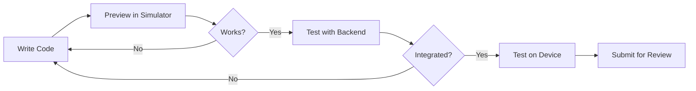

This section describes the tools and environments used to develop, test, and debug Rebell Mini Apps.

Before starting development, developers should understand how local tooling, sandbox environments, and production environments relate to each other.

## Development Environments

Rebell Mini App development typically involves multiple environments.

<Tabs>
  <Tab title="Sandbox Environment">
    **Used for:**

    - Development
    - Functional testing
    - Integration testing with merchant backend
    - Testing payment flows without real funds

    **Characteristics:**

    - Uses sandbox credentials
    - Isolated from production users
    - Supports debugging and inspection tools
    - Webhooks and backend endpoints must also point to sandbox systems

    <Info>
    Mini Apps must be explicitly promoted from sandbox to production during the publishing process.
    </Info>
  </Tab>

  <Tab title="Production Environment">
    **Used for:**

    - Real users
    - Live payments
    - Final published Mini Apps

    **Characteristics:**

    - Uses production credentials
    - Requires approved and published Mini App
    - Webhooks must be production-ready
    - Stronger security and monitoring expectations

    <Warning>
    Never use sandbox credentials in production or vice versa.
    </Warning>
  </Tab>
</Tabs>

### Environment Comparison

| Aspect | Sandbox | Production |
|--------|---------|------------|
| **Users** | Test accounts | Real customers |
| **Payments** | Simulated | Real funds |
| **Credentials** | Sandbox keys | Production keys |
| **Debugging** | Full access | Limited |
| **Webhooks** | Sandbox endpoints | Production endpoints |

## Mini Program Studio

**Mini Program Studio** is the official IDE for developing Rebell Mini Apps.

<CardGroup cols={2}>
  <Card title="Project Management" icon="folder">
    Project creation and configuration
  </Card>
  <Card title="Code Editing" icon="code">
    Source code editing with syntax highlighting
  </Card>
  <Card title="Built-in Simulator" icon="mobile-screen">
    Preview and test your Mini App locally
  </Card>
  <Card title="Debugging Tools" icon="bug">
    Inspect, log, and debug your code
  </Card>
  <Card title="Packaging" icon="box">
    Build and package your Mini App for submission
  </Card>
  <Card title="Submission" icon="upload">
    Submit Mini Apps for review and release
  </Card>
</CardGroup>

### When Mini Program Studio Is Required

Mini Program Studio is **required** for:

- Creating Native Mini Apps
- Running local simulations
- Submitting Mini Apps for review and release
- Debugging Mini App–specific behavior

## Local Development & Simulator

The Mini Program Studio includes a **simulator** that emulates the Rebell SuperApp runtime.

The simulator allows developers to:

<Steps>
  <Step title="Preview UI">
    See your Mini App interface in real-time as you code
  </Step>

  <Step title="Test Navigation">
    Validate page transitions and navigation flows
  </Step>

  <Step title="Simulate Interactions">
    Test user interactions like taps, scrolls, and form inputs
  </Step>

  <Step title="Debug Logic">
    Debug JavaScript logic with breakpoints and inspection
  </Step>

  <Step title="Inspect Logs">
    View console logs and runtime errors
  </Step>
</Steps>

<Warning>
**Important simulator limitations:**

- Simulator behavior closely matches the real SuperApp but is **not identical**
- Performance and device-specific behavior should always be validated on **real devices**
- Payment flows in the simulator use **sandbox mode**
</Warning>

### Simulator vs Real Device Testing

| Feature | Simulator | Real Device |
|---------|-----------|-------------|
| UI rendering | Approximate | Exact |
| Performance | Varies | Accurate |
| Native features | Emulated | Full |
| Payment flows | Sandbox only | Full testing |
| Debugging | Full access | Limited |

<Tip>
Always perform final testing on **real devices** before submitting for review.
</Tip>

## Project Structure

A Mini App project follows a **predefined file structure** enforced by the platform.

At a high level, a Mini App contains:

```
my-mini-app/
├── app.json              # Application configuration
├── app.js                # Application logic
├── app.css               # Global styles
├── pages/
│   ├── index/
│   │   ├── index.json    # Page configuration
│   │   ├── index.js      # Page logic
│   │   ├── index.axml    # Page layout
│   │   └── index.css     # Page styles
│   └── detail/
│       ├── detail.json
│       ├── detail.js
│       ├── detail.axml
│       └── detail.css
├── components/           # Reusable components
└── assets/               # Static assets (images, fonts)
```

### Key Files

<AccordionGroup>
  <Accordion title="app.json - Application Configuration">
    Defines global settings including:
    - Pages list and navigation
    - Window appearance
    - Tab bar configuration
    - Permission declarations
  </Accordion>

  <Accordion title="app.js - Application Logic">
    Contains:
    - Application lifecycle handlers
    - Global state management
    - Initialization logic
  </Accordion>

  <Accordion title="Page Files">
    Each page consists of four files:
    - `.json` - Page configuration
    - `.js` - Page logic and data
    - `.axml` - UI layout (XML-based)
    - `.css` - Page styles
  </Accordion>
</AccordionGroup>

Developers should follow the standard structure to ensure:

- Compatibility with the runtime
- Correct packaging and submission
- Predictable lifecycle behavior

## Tooling Differences: Native vs H5

While both Native and H5 Mini Apps use Mini Program Studio, there are differences in how tooling is used.

<Tabs>
  <Tab title="Native Mini Apps">
    - **Fully developed** inside Mini Program Studio
    - Use **platform-specific UI components**
    - Debugged primarily via the **built-in simulator**
    - All code follows the Mini App framework conventions
  </Tab>

  <Tab title="H5 Mini Apps">
    - Web content typically developed using **standard web tooling**
    - Mini Program Studio used mainly for **container configuration** and packaging
    - Debugging may involve both **browser tools** and the Mini App simulator
    - More flexibility in framework choice (React, Vue, etc.)
  </Tab>
</Tabs>

<Info>
Regardless of type, submission and release are always handled through the same platform tooling.
</Info>

## Backend Development Considerations

Mini App development always goes hand-in-hand with **merchant backend development**.

<Warning>
Mini Program Studio does not replace backend tooling; it **complements** it.
</Warning>

### Backend Preparation Checklist

<AccordionGroup>
  <Accordion title="API Endpoints">
    - [ ] Prepare backend APIs before integrating UI flows
    - [ ] Expose sandbox and production endpoints
    - [ ] Document API contracts for Mini App team
  </Accordion>

  <Accordion title="Authentication">
    - [ ] Implement authentication and authorization checks
    - [ ] Support authCode exchange flow
    - [ ] Handle session management
  </Accordion>

  <Accordion title="Payment Integration">
    - [ ] Implement payment creation endpoints
    - [ ] Handle asynchronous payment notifications (webhooks)
    - [ ] Support payment status queries
  </Accordion>

  <Accordion title="Environment Configuration">
    - [ ] Configure sandbox backend endpoints
    - [ ] Configure production backend endpoints
    - [ ] Set up environment-specific credentials
  </Accordion>
</AccordionGroup>

## Access & Account Requirements

To use Mini Program Studio and create Mini Apps, developers need:

<CardGroup cols={3}>
  <Card title="Merchant Account" icon="building">
    An approved merchant account with Rebell
  </Card>
  <Card title="Developer Console" icon="terminal">
    Access to the Rebell developer console
  </Card>
  <Card title="Roles & Permissions" icon="user-gear">
    Assigned roles and permissions for development
  </Card>
</CardGroup>

<Info>
Account creation and access management are part of the **merchant onboarding process**, which is described separately from Mini App development.
</Info>

## Development Workflow

A typical development session follows this workflow:



<Steps>
  <Step title="Local Development">
    Write code and preview in the simulator for rapid iteration
  </Step>

  <Step title="Backend Integration">
    Connect to sandbox backend and test API integrations
  </Step>

  <Step title="Device Testing">
    Test on real devices to validate performance and behavior
  </Step>

  <Step title="Payment Testing">
    Test payment flows in sandbox environment
  </Step>

  <Step title="Submission">
    Package and submit for review when ready
  </Step>
</Steps>

## Debugging Best Practices

<AccordionGroup>
  <Accordion title="Console Logging">
    Use `console.log()` for debugging, but remove excessive logging before submission
  </Accordion>

  <Accordion title="Network Inspection">
    Monitor network requests to debug API integration issues
  </Accordion>

  <Accordion title="Error Handling">
    Implement proper error handling and display meaningful error messages during development
  </Accordion>

  <Accordion title="State Inspection">
    Use the debugger to inspect component state and data flow
  </Accordion>
</AccordionGroup>

## Next Steps

With the development environment and tools in place, the next step is to understand how a Mini App evolves over time:

<CardGroup cols={2}>
  <Card title="Mini App Lifecycle" icon="rotate" href="/mini-app/lifecycle">
    Learn about creation, testing, review, and publishing stages
  </Card>
  <Card title="Mini App APIs" icon="code" href="/mini-app/apis">
    Explore the available APIs and capabilities
  </Card>
</CardGroup>
