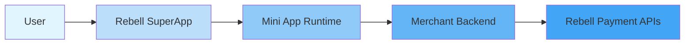

Mini Apps are lightweight applications that run inside the **Rebell SuperApp**, allowing merchants and partners to provide digital services without distributing standalone mobile applications.

They are designed to deliver **interactive, multi-step user experiences** that can seamlessly integrate payments, user identity, and merchant backend services.

<Info>
Mini Apps are **not** payment APIs. They are embedded applications executed within the Rebell runtime and accessed directly by users from the SuperApp.
</Info>

## What Is a Mini App

A Mini App is:

- A **sandboxed application** executed inside the Rebell SuperApp
- Built using a **JavaScript-based Mini Program framework**
- **Distributed and updated** centrally through Rebell
- Capable of interacting with both **Rebell APIs** and **merchant backend systems**

Mini Apps allow merchants to deliver services such as:

<CardGroup cols={2}>
  <Card title="Parking & Mobility" icon="car">
    Parking payments, EV charging, ride services
  </Card>
  <Card title="Loyalty & Rewards" icon="gift">
    Points programs, digital coupons, membership cards
  </Card>
  <Card title="Booking & Reservations" icon="calendar">
    Restaurant reservations, appointments, event tickets
  </Card>
  <Card title="Food Ordering" icon="utensils">
    In-store ordering, delivery, pickup services
  </Card>
  <Card title="Digital Onboarding" icon="user-plus">
    Account creation, KYC flows, service enrollment
  </Card>
  <Card title="Service Management" icon="gear">
    Subscription management, account settings, support
  </Card>
</CardGroup>

All without requiring users to install a separate app.

## What a Mini App Is NOT

<Warning>
A Mini App is **not**:

- A standalone mobile application
- A replacement for server-to-server Payment APIs
- A backend system
- A generic web page embedded in a webview
</Warning>

Mini Apps rely on a **merchant backend** for business logic and persistent data. Rebell serves only as the execution and distribution environment.

## Mini Apps vs Payment API Integration

Rebell supports two complementary integration models. Choose based on your existing infrastructure and user experience goals.

<Tabs>
  <Tab title="Payment API Integration">
    **Best suited when you already have:**

    - A mobile app or website
    - A POS or backend-driven checkout
    - A need for payment-only functionality

    **Characteristics:**

    - Server-to-server APIs
    - Merchant controls the UI
    - Payments are initiated externally
    - Ideal for ecommerce and POS

    **Learn more:** [Payment Integration Guide](/payment-integration/quick-integration-guide)
  </Tab>

  <Tab title="Mini App Integration">
    **Best suited when you want to:**

    - Offer a complete digital service inside the SuperApp
    - Guide users through multiple steps
    - Leverage Rebell-native navigation and identity
    - Embed payments as part of a service flow

    **Characteristics:**

    - Runs inside Rebell SuperApp
    - Uses Mini App framework and JSAPI
    - UI is hosted and rendered by Rebell
    - Payments are part of the user journey
  </Tab>
</Tabs>

### Comparison Summary

| Aspect | Payment APIs | Mini Apps |
|--------|--------------|-----------|
| **Execution** | Merchant backend | Rebell SuperApp |
| **UI ownership** | Merchant | Rebell-hosted |
| **Use case** | Checkout / POS | Full service experience |
| **User context** | External | Native SuperApp |
| **Payment support** | Yes | Yes (embedded) |
| **Distribution** | Merchant-managed | Rebell-managed |

<Tip>
Mini Apps and Payment APIs can be **combined**: a Mini App may call merchant backend APIs, which in turn interact with Rebell Payment APIs.
</Tip>

## High-Level Architecture

At a conceptual level, a Mini App involves three main actors:

- The **Mini App** handles user interaction and UI
- The **merchant backend** handles business logic and data
- **Payments** are initiated either from the Mini App UI or via backend calls

This separation ensures security, scalability, and regulatory compliance.

## When to Choose a Mini App

<AccordionGroup>
  <Accordion title="Choose a Mini App when...">
    - The service requires **multiple user interactions**
    - The experience should live **entirely inside the SuperApp**
    - You want to leverage Rebell's **identity and navigation**
    - You want **centralized updates** without app store releases
    - You need a **native-feeling** experience for users
  </Accordion>

  <Accordion title="Do NOT choose a Mini App if...">
    - You only need a **payment button** or API-based checkout
    - You already have a mobile app that handles the full user journey
    - Your use case is **purely transactional** without UI flow
  </Accordion>
</AccordionGroup>

## Developer Journey

The typical Mini App development flow follows these stages:

<Steps>
  <Step title="Understand Concepts">
    Learn Mini App concepts and architecture
  </Step>

  <Step title="Set Up Environment">
    Install Mini Program Studio and configure sandbox access
  </Step>

  <Step title="Build Mini App">
    Develop Mini App UI and client-side logic
  </Step>

  <Step title="Integrate Backend">
    Connect to merchant backend APIs
  </Step>

  <Step title="Add Payments">
    Integrate payments where required
  </Step>

  <Step title="Test">
    Test using simulator and sandbox environment
  </Step>

  <Step title="Submit for Review">
    Submit Mini App for Rebell review
  </Step>

  <Step title="Publish & Maintain">
    Publish to production and maintain versions
  </Step>
</Steps>

## What This Section Covers

The Mini App Development section explains:

<CardGroup cols={2}>
  <Card title="Architecture & Concepts" icon="sitemap" href="/mini-app/architecture-concepts">
    How Mini Apps are architected and executed
  </Card>
  <Card title="Development Environment" icon="laptop-code" href="/mini-app/development-environment">
    Tools used to develop and test Mini Apps
  </Card>
  <Card title="Mini App Lifecycle" icon="rotate" href="/mini-app/lifecycle">
    How Mini Apps are reviewed, published, and versioned
  </Card>
  <Card title="Mini App APIs" icon="code" href="/mini-app/apis">
    Available APIs (JSAPI, OpenAPI, components)
  </Card>
  <Card title="Backend Authentication" icon="shield-halved" href="/mini-app/backend-authentication">
    How Mini Apps authenticate with merchant backends
  </Card>
  <Card title="Payments" icon="credit-card" href="/mini-app/payments">
    How payments are triggered inside Mini Apps
  </Card>
</CardGroup>

## Next Steps

Ready to start building? Begin with understanding the architecture:

<Card title="Architecture & Concepts" icon="arrow-right" href="/mini-app/architecture-concepts">
  Learn how Mini Apps are architected within the Rebell ecosystem
</Card>
