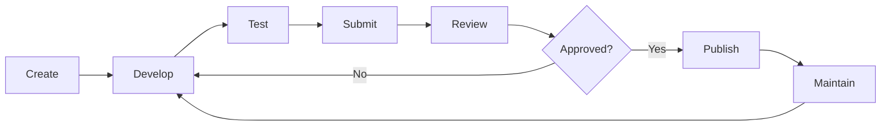
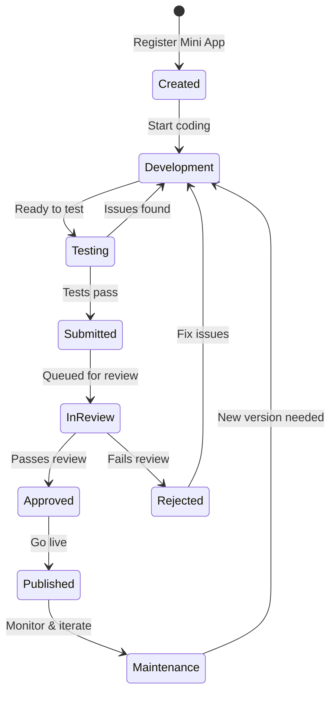

This section describes the lifecycle of a Mini App, from initial creation to publication and ongoing maintenance.

Understanding this lifecycle helps merchants plan development, testing, and release activities correctly.

## Lifecycle Overview

A Mini App progresses through the following stages:

<Steps>
  <Step title="Create">
    Register Mini App and set up project
  </Step>

  <Step title="Develop">
    Build UI, logic, and backend integrations
  </Step>

  <Step title="Test">
    Validate functionality in sandbox
  </Step>

  <Step title="Submit">
    Package and submit for review
  </Step>

  <Step title="Review">
    Rebell reviews for compliance and quality
  </Step>

  <Step title="Publish">
    Release to production users
  </Step>

  <Step title="Maintain">
    Bug fixes, updates, and versioning
  </Step>
</Steps>

Each stage has a specific purpose and set of responsibilities.

## Create

The lifecycle begins with the **creation** of a Mini App project.

At this stage:

- A new Mini App is registered in the **Rebell developer console**
- A unique **Mini App identifier** is assigned
- The **Mini App type** is selected (Native or H5)
- Basic **metadata** is defined (name, description, category)

<Info>
Creation does **not** make the Mini App visible to users. It only establishes the project container used during development.
</Info>

### Registration Information

| Field | Description | Required |
|-------|-------------|----------|
| Mini App Name | Display name in SuperApp | Yes |
| Description | Short description of service | Yes |
| Category | Service category (e.g., Food, Transport) | Yes |
| Mini App Type | Native or H5 | Yes |
| Icon | App icon for display | Yes |

## Develop

During development:

<CardGroup cols={2}>
  <Card title="UI Implementation" icon="paintbrush">
    Mini App UI and client-side logic are implemented
  </Card>
  <Card title="Backend Integration" icon="server">
    Backend APIs are integrated
  </Card>
  <Card title="Navigation" icon="compass">
    Navigation flows are defined
  </Card>
  <Card title="Payments" icon="credit-card">
    Payment triggers are implemented where required
  </Card>
</CardGroup>

Development is typically performed using **Mini Program Studio**, supported by:

- Local simulator
- Logging and debugging tools

<Warning>
At this stage, the Mini App exists **only in the sandbox environment**.
</Warning>

### Development Checklist

<AccordionGroup>
  <Accordion title="Core Implementation">
    - [ ] All pages and components implemented
    - [ ] Navigation flows working correctly
    - [ ] Data binding and state management complete
    - [ ] Error handling implemented
  </Accordion>

  <Accordion title="Backend Integration">
    - [ ] API endpoints connected
    - [ ] Authentication flow implemented
    - [ ] Data loading and caching working
    - [ ] Error states handled
  </Accordion>

  <Accordion title="Payment Integration (if applicable)">
    - [ ] Payment flow triggers implemented
    - [ ] Payment UI integration complete
    - [ ] Error and cancellation handling
    - [ ] Success/failure states displayed
  </Accordion>
</AccordionGroup>

## Test

Testing validates that the Mini App behaves correctly before submission.

### Testing Activities

<Tabs>
  <Tab title="Functional Testing">
    - Test all user flows end-to-end
    - Validate navigation and transitions
    - Test form inputs and validation
    - Verify data display and updates
  </Tab>

  <Tab title="Backend Integration Testing">
    - Test API requests and responses
    - Validate error handling
    - Test timeout scenarios
    - Verify data consistency
  </Tab>

  <Tab title="Payment Testing">
    - Test payment flows in sandbox
    - Verify success scenarios
    - Test cancellation handling
    - Validate error states
  </Tab>

  <Tab title="Edge Case Testing">
    - Test with slow network
    - Test offline scenarios
    - Validate recovery from errors
    - Test with various data states
  </Tab>
</Tabs>

### Recommended Test Scenarios

<AccordionGroup>
  <Accordion title="User Scenarios">
    - [ ] New user first-time experience
    - [ ] Returning user flow
    - [ ] User with empty data state
    - [ ] User with maximum data
  </Accordion>

  <Accordion title="Error Scenarios">
    - [ ] Network timeout
    - [ ] API error response
    - [ ] Invalid data input
    - [ ] Session expiration
  </Accordion>

  <Accordion title="Payment Scenarios (if applicable)">
    - [ ] Successful payment
    - [ ] User cancels payment
    - [ ] Payment fails (insufficient funds)
    - [ ] Network error during payment
  </Accordion>
</AccordionGroup>

<Tip>
Only Mini Apps that pass internal testing should proceed to submission.
</Tip>

## Submit

Once development and testing are complete, the Mini App is **submitted for review**.

Submission involves:

<Steps>
  <Step title="Package">
    Mini App code is packaged for deployment
  </Step>

  <Step title="Select Environment">
    Choose target environment (typically production)
  </Step>

  <Step title="Provide Metadata">
    Supply required metadata and documentation
  </Step>

  <Step title="Submit">
    Submit package to Rebell for review
  </Step>
</Steps>

<Warning>
Submission **freezes** the version being reviewed. Further changes require creating a new version.
</Warning>

### Submission Requirements

| Requirement | Description |
|-------------|-------------|
| **Functionality** | All features working as documented |
| **Metadata** | Complete and accurate app information |
| **Screenshots** | Screenshots for store listing |
| **Privacy Policy** | Privacy policy URL (if collecting user data) |
| **Test Accounts** | Test credentials for reviewers (if needed) |

## Review

Rebell performs a review before allowing publication.

### Review Areas

<CardGroup cols={2}>
  <Card title="Compliance" icon="scale-balanced">
    Platform guidelines and policies
  </Card>
  <Card title="Security" icon="shield">
    Security and data usage practices
  </Card>
  <Card title="Payment Flow" icon="credit-card">
    Payment flow correctness
  </Card>
  <Card title="UX Consistency" icon="palette">
    User experience consistency
  </Card>
  <Card title="Technical Stability" icon="server">
    Technical stability and performance
  </Card>
  <Card title="Content" icon="file-lines">
    Content appropriateness
  </Card>
</CardGroup>

### Review Outcomes

<Tabs>
  <Tab title="Approved">
    - Mini App is eligible for publication
    - No further action required before publishing
    - Merchant can choose when to go live
  </Tab>

  <Tab title="Rejected">
    - Feedback is provided with specific issues
    - Resubmission is required after fixes
    - Must address all rejection reasons
  </Tab>
</Tabs>

<Info>
Review timelines and criteria are defined by Rebell and may vary by Mini App category.
</Info>

## Publish

After approval, the Mini App can be **published to production**.

Publishing:

- Makes the Mini App **available to real users**
- Activates **production configuration**
- Enables **live payments**

<Warning>
Publication is an **explicit action** and does not occur automatically after approval.
</Warning>

### Pre-Publication Checklist

<AccordionGroup>
  <Accordion title="Backend Readiness">
    - [ ] Production backend deployed
    - [ ] Production credentials configured
    - [ ] Webhook endpoints ready
    - [ ] Monitoring enabled
  </Accordion>

  <Accordion title="Configuration">
    - [ ] Production API endpoints configured
    - [ ] Production credentials active
    - [ ] Sandbox references removed
  </Accordion>

  <Accordion title="Operational Readiness">
    - [ ] Support team briefed
    - [ ] Runbook prepared
    - [ ] Escalation paths defined
  </Accordion>
</AccordionGroup>

## Maintain

After publication, the Mini App enters the **maintenance phase**.

Maintenance includes:

<CardGroup cols={2}>
  <Card title="Bug Fixes" icon="bug">
    Address issues reported by users
  </Card>
  <Card title="Feature Enhancements" icon="sparkles">
    Add new capabilities
  </Card>
  <Card title="Performance" icon="gauge-high">
    Optimize performance
  </Card>
  <Card title="Security Updates" icon="lock">
    Address security issues
  </Card>
</CardGroup>

<Info>
Each update:
- Requires a **new version**
- Follows the same **submit → review → publish** process
</Info>

## Versioning & Rollback

Mini Apps are versioned explicitly.

### Versioning Principles

| Principle | Description |
|-----------|-------------|
| **Version per release** | Each release corresponds to a version |
| **Multiple internal versions** | Multiple versions may exist internally |
| **Single active version** | Only one version is active for users |
| **Immutable releases** | Published versions cannot be modified |

### Rollback

Rollback is available for risk mitigation:

<Tabs>
  <Tab title="When to Rollback">
    - Critical bug discovered after release
    - Performance degradation in production
    - Security vulnerability identified
    - Compliance issue detected
  </Tab>

  <Tab title="Rollback Process">
    - Requires explicit action through the platform
    - Reverts to a **previously approved version**
    - Does not bypass review requirements for new changes
    - Should be followed by a proper fix submission
  </Tab>
</Tabs>

<Warning>
Versioning and rollback are essential for safe long-term operation. Always maintain at least one stable previous version.
</Warning>

## Lifecycle Responsibilities

| Stage | Primary Responsibility |
|-------|------------------------|
| Create | Merchant |
| Develop | Merchant |
| Test | Merchant |
| Submit | Merchant |
| Review | Rebell |
| Publish | Merchant |
| Maintain | Merchant |

## Lifecycle State Diagram

## Next Steps

With the Mini App lifecycle understood, the next step is to explore the APIs and capabilities available to Mini Apps:

<CardGroup cols={2}>
  <Card title="Mini App APIs" icon="code" href="/mini-app/apis">
    Learn about JSAPI and OpenAPI
  </Card>
  <Card title="Backend Authentication" icon="shield-halved" href="/mini-app/backend-authentication">
    Implement secure backend authentication
  </Card>
</CardGroup>
