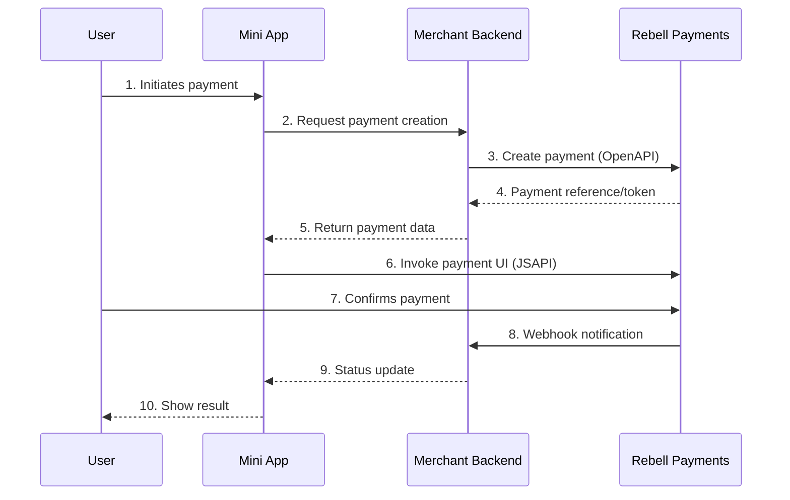
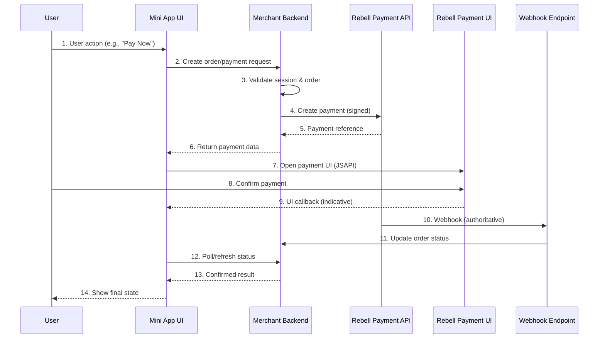

Mini Apps can embed payment experiences as part of a broader user journey. While the user interaction happens inside the Mini App, all payment execution and final confirmation follow the same rules defined in the [Payment Integration](/payment-integration/quick-integration-guide) chapter.

This section explains how Mini Apps trigger payments, which invocation models are supported, and how user authorization and backend responsibilities fit together.

## Core Principles

<Warning>
Payments inside Mini Apps follow these **core principles**:

- Mini Apps **never authorize or finalize** payments
- Mini Apps **only trigger** payment experiences
- Merchant backends are the **only components allowed** to call Rebell Payment APIs
- Final payment results are delivered **asynchronously via webhooks**
- Mini App UI must **always reflect backend-confirmed state**
</Warning>

## Mini App Payment Capabilities (JSAPI)

The Rebell platform exposes payment-related capabilities to Mini Apps through client-side APIs (JSAPI).

These capabilities allow a Mini App to:

<CardGroup cols={3}>
  <Card title="Initiate Payment" icon="play">
    Start a payment flow from the UI
  </Card>
  <Card title="Open Payment UI" icon="window-maximize">
    Display the Rebell payment confirmation screen
  </Card>
  <Card title="Resume Payment" icon="rotate-right">
    Continue an existing payment flow
  </Card>
</CardGroup>

### What JSAPI Payment Capabilities Do NOT Do

<Tabs>
  <Tab title="Do Not Create Payments">
    Payments must be created server-side via OpenAPI
  </Tab>
  <Tab title="Do Not Authorize Payments">
    Authorization happens in the Rebell payment UI, not the Mini App
  </Tab>
  <Tab title="Do Not Return Final Results">
    JSAPI results are indicative only; use webhooks for confirmation
  </Tab>
</Tabs>

They act as **entry points** into the Rebell payment UX, always relying on a payment that has already been created or prepared by the merchant backend.

## Supported Payment Invocation Models

Mini Apps support multiple payment invocation models. The correct model depends on **where the payment is created** and **how the Mini App triggers the payment UI**.

### Model A: Backend-Created Payment, Mini App–Triggered (Recommended)

This is the most common and **recommended** model.



**Characteristics:**

- Backend remains **fully in control** of payment creation
- Mini App only triggers the **user-facing confirmation**
- Clear **separation of responsibilities**
- Best alignment with **security and compliance** requirements

**Suitable for:**

- Service flows
- Bookings
- Digital goods
- Any user-initiated payment inside a Mini App

<Tip>
This model is recommended for **all new integrations**.
</Tip>

### Model B: Mini App–Triggered, Backend-Completed (Advanced)

In this model, the Mini App initiates the intent to pay, but the backend completes or resumes the payment asynchronously.

**Flow overview:**

<Steps>
  <Step title="Trigger Intent">
    Mini App triggers a payment intent
  </Step>

  <Step title="Backend Creates/Resumes">
    Merchant backend creates or resumes a payment
  </Step>

  <Step title="Invoke UI">
    Mini App invokes the payment UI using a backend-provided reference
  </Step>

  <Step title="Standard Flow">
    Payment completes through standard Rebell flows
  </Step>

  <Step title="Webhook Confirmation">
    Merchant backend receives webhook
  </Step>
</Steps>

**Characteristics:**

- Used to **resume existing** or external payment flows
- Requires careful **backend coordination**
- **Higher complexity** than Model A

<Warning>
This model is intended for **resuming or continuing** an existing payment and should not be used for standard checkout flows.
</Warning>

## End-to-End Payment Flow (Mini App Perspective)

From a Mini App perspective, a complete payment flow looks like this:



**Key points:**

- The Mini App **never decides** the payment outcome
- The backend **confirms** success or failure
- The UI reflects **backend-confirmed state only**

## Implementation Guide

### Step 1: Create Payment on Backend

When user initiates payment in Mini App:

<CodeGroup>

```javascript Mini App (Client)
// User taps "Pay" button
async function handlePayment(orderId) {
  my.showLoading({ content: 'Preparing payment...' });

  try {
    // Call backend to create payment
    const response = await callBackend('/orders/' + orderId + '/pay', {
      method: 'POST'
    });

    const { paymentReference, tradeNO } = response;

    // Invoke payment UI
    invokePaymentUI(tradeNO);

  } catch (error) {
    my.hideLoading();
    my.showToast({ content: 'Payment failed', type: 'fail' });
  }
}
```

```javascript Backend (Server)
app.post('/orders/:orderId/pay', async (req, res) => {
  const { orderId } = req.params;
  const session = await getSession(req);

  // Validate session
  if (!session) {
    return res.status(401).json({ error: 'Not authenticated' });
  }

  // Get order and validate ownership
  const order = await getOrder(orderId);
  if (order.userId !== session.rebellUserId) {
    return res.status(403).json({ error: 'Not authorized' });
  }

  // Create payment with Rebell
  const paymentResponse = await rebellClient.post('/v1/payments/linkPayCreate', {
    paymentRequestId: generateUniqueId(),
    order: {
      orderDescription: order.description,
      orderAmount: {
        value: order.amount.toString(),
        currency: order.currency
      }
    },
    paymentNotifyUrl: process.env.WEBHOOK_URL
  });

  // Store payment reference
  await updateOrder(orderId, {
    paymentId: paymentResponse.paymentId,
    paymentStatus: 'PENDING'
  });

  // Return reference to Mini App
  res.json({
    tradeNO: paymentResponse.paymentId,
    paymentReference: paymentResponse.paymentId
  });
});
```

</CodeGroup>

### Step 2: Invoke Payment UI (JSAPI)

```javascript
function invokePaymentUI(tradeNO) {
  my.tradePay({
    tradeNO: tradeNO,
    success: (res) => {
      my.hideLoading();

      // NOTE: This is INDICATIVE only!
      if (res.resultCode === '9000') {
        // Show pending state, poll for confirmation
        showPendingState();
        pollPaymentStatus();
      } else if (res.resultCode === '6001') {
        // User cancelled
        showCancelledState();
      } else {
        // Other result - still poll backend
        pollPaymentStatus();
      }
    },
    fail: (err) => {
      my.hideLoading();
      handlePaymentError(err);
    }
  });
}
```

### JSAPI Result Codes

| Code | Meaning | Action |
|------|---------|--------|
| `9000` | Payment appears successful | Poll backend for confirmation |
| `6001` | User cancelled | Allow retry |
| `6002` | Network error | Retry or poll status |
| `4000` | Order paid or closed | Check backend status |
| Other | Unknown | Poll backend status |

<Warning>
**Never trust JSAPI result codes as final.** Always confirm with backend status.
</Warning>

### Step 3: Handle Webhook (Backend)

```javascript
app.post('/webhooks/payment', async (req, res) => {
  // 1. Verify signature
  const isValid = verifyWebhookSignature(req.headers, req.body);
  if (!isValid) {
    return res.status(401).send('Invalid signature');
  }

  // 2. Extract payment info
  const { paymentId, paymentRequestId, result } = req.body;

  // 3. Find and update order (idempotent)
  const order = await findOrderByPaymentId(paymentId);
  if (!order) {
    console.error('Order not found for payment:', paymentId);
    return res.status(200).send('OK'); // Still acknowledge
  }

  // 4. Update only if not already final
  if (order.paymentStatus !== 'SUCCESS' && order.paymentStatus !== 'FAILED') {
    await updateOrder(order.id, {
      paymentStatus: result.resultStatus === 'S' ? 'SUCCESS' : 'FAILED',
      paymentResult: result
    });
  }

  // 5. Acknowledge receipt
  res.status(200).send('OK');
});
```

### Step 4: Poll for Status (Mini App)

```javascript
async function pollPaymentStatus() {
  const maxAttempts = 10;
  const intervalMs = 3000;

  for (let i = 0; i < maxAttempts; i++) {
    try {
      const status = await callBackend('/orders/' + orderId + '/status');

      if (status.paymentStatus === 'SUCCESS') {
        showSuccessState();
        return;
      } else if (status.paymentStatus === 'FAILED') {
        showFailedState();
        return;
      }

      // Still pending, wait and retry
      await sleep(intervalMs);

    } catch (error) {
      console.error('Status check failed:', error);
    }
  }

  // Max attempts reached
  showUnknownState();
}
```

## User Authorization & Identity in Payment Flows

Mini Apps operate within a user session provided by the Rebell SuperApp, but they must not assume unrestricted access to user information.

Before accessing certain user data or performing sensitive actions, a Mini App must:

<Steps>
  <Step title="Request Authorization">
    Explicitly request user authorization via JSAPI
  </Step>

  <Step title="Inform User">
    Clearly inform the user about the requested scope
  </Step>

  <Step title="Respect Consent">
    Respect user consent decisions
  </Step>
</Steps>

**User authorization in Mini Apps:**

| Property | Description |
|----------|-------------|
| **Consent-based** | User must explicitly approve |
| **Scoped** | Limited to requested permissions |
| **Revocable** | User can revoke access |
| **No credentials exposed** | No sensitive identifiers shared |

For payment-related flows, authorization may be required to:

- Associate the payment with the correct user
- Personalize the user experience
- Fulfill regulatory or compliance requirements

<Info>
Mini Apps must always treat user identity information as **contextual**, not as a source of truth. The merchant backend remains responsible for validating and persisting user-related data.
</Info>

## UX and Error Handling Guidelines

Mini App payment UX must be **explicit and transparent**.

### Recommended Practices

<AccordionGroup>
  <Accordion title="Before Payment">
    - Clearly present payment details before initiation
    - Show amount, description, and merchant name
    - Provide clear "Pay" call-to-action
  </Accordion>

  <Accordion title="During Payment">
    - Inform users when they are entering a payment step
    - Display loading/pending states while awaiting confirmation
    - Don't close payment UI prematurely
  </Accordion>

  <Accordion title="After Payment">
    - Handle user cancellation gracefully
    - Map technical failures to user-friendly messages
    - Show confirmation only after backend confirms
  </Accordion>
</AccordionGroup>

### Common UI States

<Tabs>
  <Tab title="Initiating">
    Show loading indicator while preparing payment

    ```javascript
    my.showLoading({ content: 'Preparing payment...' });
    ```
  </Tab>

  <Tab title="Waiting">
    Display pending state while user completes payment

    ```javascript
    // Show in-app pending indicator
    setPageData({ status: 'waiting' });
    ```
  </Tab>

  <Tab title="Success">
    Confirm success **only** after backend verification

    ```javascript
    my.showToast({
      content: 'Payment successful!',
      type: 'success'
    });
    navigateTo('/orders/' + orderId + '/confirmation');
    ```
  </Tab>

  <Tab title="Failed">
    Show failure with actionable next steps

    ```javascript
    my.confirm({
      title: 'Payment Failed',
      content: 'Would you like to try again?',
      confirmButtonText: 'Retry',
      success: (res) => {
        if (res.confirm) {
          handlePayment(orderId);
        }
      }
    });
    ```
  </Tab>
</Tabs>

<Warning>
Mini Apps must **not** display "payment successful" until the backend confirms the result.
</Warning>

### Error Message Mapping

| Technical Error | User Message |
|-----------------|--------------|
| Network timeout | "Connection issue. Please try again." |
| User cancelled | "Payment cancelled. You can try again when ready." |
| Insufficient funds | "Payment could not be completed. Please check your balance." |
| Invalid payment | "Something went wrong. Please try again." |
| Backend error | "We're having trouble. Please try again later." |

## Security Rules

When implementing payments inside Mini Apps:

<Warning>
**Never:**

- Embed API keys or secrets in Mini App code
- Sign payment requests client-side
- Trust client-side payment status
- Display success without backend confirmation
</Warning>

<Tip>
**Always:**

- Rely on backend webhook confirmation
- Enforce idempotency on backend payment creation
- Validate user session before creating payments
- Log all payment attempts and results
</Tip>

### Security Checklist

<AccordionGroup>
  <Accordion title="Client-Side Security">
    - [ ] No secrets in Mini App code
    - [ ] No direct Rebell API calls
    - [ ] Payment status from backend only
    - [ ] Session-based authentication
  </Accordion>

  <Accordion title="Backend Security">
    - [ ] Webhook signature verification
    - [ ] Session validation before payment
    - [ ] Idempotent payment creation
    - [ ] Order ownership validation
  </Accordion>

  <Accordion title="UX Security">
    - [ ] Clear payment amount display
    - [ ] No misleading success messages
    - [ ] Proper error handling
    - [ ] Cancellation support
  </Accordion>
</AccordionGroup>

## Testing Payments

### Sandbox Testing Checklist

<AccordionGroup>
  <Accordion title="Happy Path">
    - [ ] Payment created successfully
    - [ ] Payment UI opens correctly
    - [ ] User can complete payment
    - [ ] Webhook received
    - [ ] UI shows confirmed success
  </Accordion>

  <Accordion title="Cancellation">
    - [ ] User cancels payment
    - [ ] Mini App handles gracefully
    - [ ] Can retry payment
    - [ ] No duplicate payments created
  </Accordion>

  <Accordion title="Errors">
    - [ ] Network timeout handling
    - [ ] Backend error handling
    - [ ] Invalid session handling
    - [ ] Expired payment handling
  </Accordion>

  <Accordion title="Edge Cases">
    - [ ] Double-tap prevention
    - [ ] App backgrounding during payment
    - [ ] Webhook delay handling
    - [ ] Concurrent payment attempts
  </Accordion>
</AccordionGroup>

## Relationship with Payment Integration Chapter

This section explains how Mini Apps trigger and embed payments.

For full details on:

- Payment creation
- Payment lifecycle
- Error handling
- Inquiry API
- Webhooks

Refer to the [Payment Integration](/payment-integration/quick-integration-guide) chapter.

## Next Steps

<CardGroup cols={2}>
  <Card title="Payment Integration Guide" icon="book" href="/payment-integration/quick-integration-guide">
    Complete payment integration reference
  </Card>
  <Card title="Webhooks" icon="webhook" href="/payment-integration/webhooks">
    Webhook implementation details
  </Card>
  <Card title="Error Handling" icon="triangle-exclamation" href="/payment-integration/error-handling">
    Error codes and recovery logic
  </Card>
  <Card title="Backend Authentication" icon="shield-halved" href="/mini-app/backend-authentication">
    Review authentication flow
  </Card>
</CardGroup>
