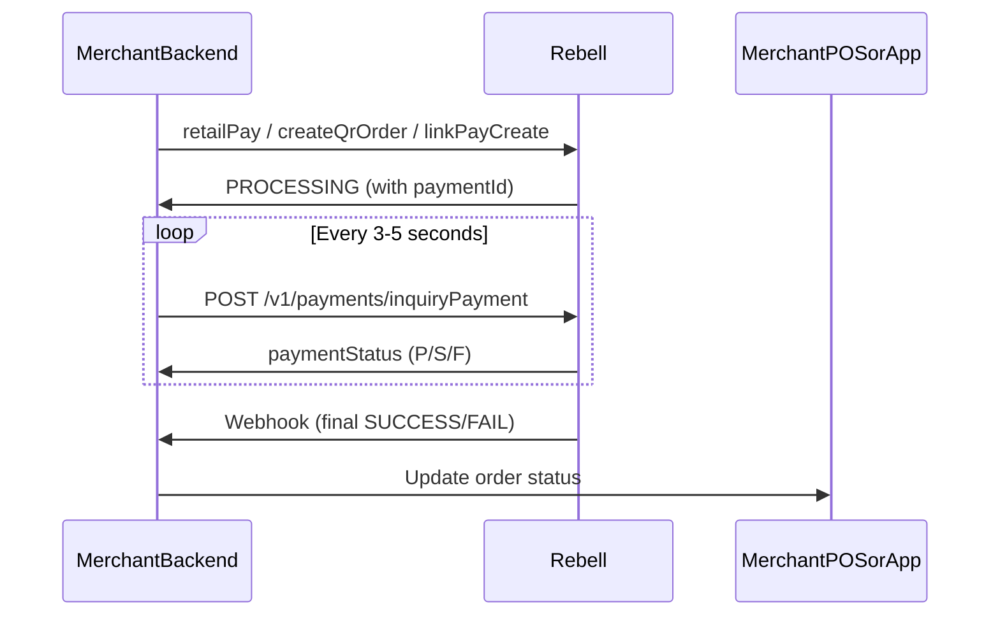

The Inquiry Payment API allows your backend to retrieve the current status of a payment previously created using [Retail Pay](/payment-integration/retail-pay), [QR Order Pay](/payment-integration/qr-order-pay), or [Link Pay](/payment-integration/link-pay).

This API is essential for handling `PROCESSING` states and ensuring order synchronization when webhook delivery is delayed or temporarily unavailable.

<Warning>
**Important Limitation**

Inquiry **MUST NOT** be used as a substitute for webhooks. Webhooks remain the **source of truth**; Inquiry is a supplementary polling mechanism.
</Warning>

## When to Use Inquiry

<Tabs>
  <Tab title="Use Inquiry When">
    **Appropriate use cases:**

    - Rebell returns `PROCESSING` for Retail Pay or QR Order
    - User initiated a Link Pay flow but the webhook has not yet arrived
    - Merchant needs to confirm payment status after network interruptions
    - Merchant receives ambiguous or delayed responses
    - Merchant needs status checks during POS timeout handling
  </Tab>

  <Tab title="Do NOT Use Inquiry">
    **Inappropriate use cases:**

    - ❌ As a replacement for webhook confirmation
    - ❌ For continuous long-term polling (not allowed)
    - ❌ To retrieve historical transactions (use settlement reports instead)
    - ❌ As the primary method to determine payment status
  </Tab>
</Tabs>

## Inquiry Flow Overview

<Steps>
  <Step title="Create Payment">
    Merchant creates a payment using Retail Pay, QR Order, or Link Pay
  </Step>

  <Step title="Receive Payment ID">
    Rebell returns a `paymentId`
  </Step>

  <Step title="Start Polling (if needed)">
    If the initial response is `PROCESSING`, merchant begins polling Inquiry
  </Step>

  <Step title="Poll at Intervals">
    Merchant calls Inquiry every 3-5 seconds, up to a defined timeout window
  </Step>

  <Step title="Receive Status">
    Inquiry returns one of: `SUCCESS`, `FAIL`, or `PROCESSING`
  </Step>

  <Step title="Webhook Delivery">
    Webhook eventually delivers the final status
  </Step>

  <Step title="Update Order">
    Merchant system updates the order state
  </Step>
</Steps>

## Sequence Diagram



## API Specification

### Endpoint

```
POST /v1/payments/inquiryPayment
```

### Request Headers

Include standard [authentication headers](/payment-integration/authentication-environments):

```http
Client-Id: your-client-id
Request-Time: 2024-01-10T12:22:30Z
Signature: algorithm=SHA256withRSA, keyVersion=1, signature=...
Content-Type: application/json
```

### Request Body

<ParamField path="paymentId" type="string" required>
  The payment identifier returned during initial payment creation
</ParamField>

<ParamField path="paymentRequestId" type="string">
  Merchant's internal order ID (recommended for validation)
</ParamField>

**Example Request:**

```json
{
  "paymentId": "2024032100123456",
  "paymentRequestId": "checkout-20240321-987"
}
```

### Response Parameters

<ResponseField name="result" type="object" required>
  API call result details

  <Expandable title="properties">
    <ResponseField name="resultCode" type="string">
      Result code for the API call itself (SUCCESS, FAIL, etc.)
    </ResponseField>

    <ResponseField name="resultStatus" type="string">
      Status indicator: "S" (success), "F" (fail)
    </ResponseField>
  </Expandable>
</ResponseField>

<ResponseField name="paymentStatus" type="string" required>
  The current status of the payment: `SUCCESS`, `FAIL`, or `PROCESSING`
</ResponseField>

<ResponseField name="paymentId" type="string">
  The payment identifier
</ResponseField>

<ResponseField name="paymentAmount" type="object">
  Payment amount details (present on SUCCESS)

  <Expandable title="properties">
    <ResponseField name="currency" type="string">
      Currency code (e.g., "EUR")
    </ResponseField>

    <ResponseField name="value" type="integer">
      Amount in minor units
    </ResponseField>
  </Expandable>
</ResponseField>

<ResponseField name="paymentTime" type="string">
  ISO 8601 timestamp of when payment was completed (present on SUCCESS)
</ResponseField>

<ResponseField name="failureReason" type="string">
  Reason for payment failure (present on FAIL)
</ResponseField>

**Response Examples:**

<CodeGroup>

```json Success
{
  "result": {
    "resultCode": "SUCCESS",
    "resultStatus": "S"
  },
  "paymentStatus": "SUCCESS",
  "paymentId": "2024032100123456",
  "paymentAmount": {
    "currency": "EUR",
    "value": 499
  },
  "paymentTime": "2024-03-21T10:15:33Z"
}
```

```json Processing
{
  "result": {
    "resultCode": "SUCCESS",
    "resultStatus": "S"
  },
  "paymentStatus": "PROCESSING",
  "paymentId": "2024032100123456"
}
```

```json Failure
{
  "result": {
    "resultCode": "SUCCESS",
    "resultStatus": "S"
  },
  "paymentStatus": "FAIL",
  "paymentId": "2024032100123456",
  "failureReason": "USER_REJECTED"
}
```

</CodeGroup>

## Payment Status Values

| Status | Meaning | Final State |
|--------|---------|-------------|
| `SUCCESS` | Payment fully authorized and final | Yes |
| `FAIL` | Payment rejected or expired | Yes |
| `PROCESSING` | Transaction is still being confirmed | No |

<Info>
Only `SUCCESS` or `FAIL` represent final states. `PROCESSING` means polling should continue until timeout or webhook arrival.
</Info>

## Handling Inquiry Responses

### When Inquiry Returns SUCCESS

<Check>
**Payment completed - take action immediately**

- Immediately mark order as PAID
- Stop polling
- Do not retry the same payment
- Wait for webhook to confirm integrity (but not required to proceed)
</Check>

### When Inquiry Returns FAIL

<Error>
**Payment failed - allow retry**

Common causes:
- User rejected payment
- Insufficient balance
- Payment expired
- Risk or AML rejection

**Merchant MUST:**
- Mark order as NOT PAID
- Allow user to attempt a new payment
- Never retry the same `paymentId`
</Error>

### When Inquiry Returns PROCESSING

<Warning>
**Payment pending - continue polling**

**Merchant SHOULD:**
- Continue polling every 3-5 seconds
- Stop after a maximum of 30-45 seconds
- Display pending UI to user
- Wait for webhook if user is still active
</Warning>

### Timeout Handling

If Inquiry returns `PROCESSING` for too long:

```
If webhooks active   → Stop polling and wait for webhook
If webhooks down     → Notify POS operator / user to retry
```

## Polling Implementation

Here's a recommended polling implementation:

```javascript Polling Logic
async function pollPaymentStatus(paymentId, paymentRequestId) {
  const MAX_ATTEMPTS = 10;        // 30-45 seconds total
  const POLL_INTERVAL = 3000;     // 3 seconds between polls
  let attempts = 0;

  while (attempts < MAX_ATTEMPTS) {
    const response = await rebellAPI.inquiryPayment({
      paymentId,
      paymentRequestId
    });

    switch (response.paymentStatus) {
      case 'SUCCESS':
        return {
          status: 'paid',
          paymentTime: response.paymentTime,
          amount: response.paymentAmount
        };

      case 'FAIL':
        return {
          status: 'failed',
          reason: response.failureReason
        };

      case 'PROCESSING':
        // Continue polling
        attempts++;
        await new Promise(resolve => setTimeout(resolve, POLL_INTERVAL));
        break;
    }
  }

  // Timeout reached - wait for webhook
  return {
    status: 'pending',
    message: 'Polling timeout - waiting for webhook confirmation'
  };
}
```

## Error Scenarios & Recovery

<AccordionGroup>
  <Accordion title="PAYMENT_NOT_FOUND">
    **Cause:** Inquiry called with invalid or unknown `paymentId`

    **Recovery:**
    - Check mapping between `paymentRequestId` and `paymentId`
    - Ensure correct environment (sandbox vs production)
    - Verify the payment was actually created
  </Accordion>

  <Accordion title="PARAM_ILLEGAL">
    **Cause:** Request body invalid

    **Recovery:**
    - Ensure correct JSON serialization
    - Validate presence of `paymentId`
    - Check for malformed request body
  </Accordion>

  <Accordion title="ACCESS_DENIED">
    **Cause:** Credentials do not match payment's merchant

    **Recovery:**
    - Verify `Client-Id` used in signing
    - Ensure key rotation did not switch to wrong key
    - Confirm the payment belongs to your merchant account
  </Accordion>

  <Accordion title="REQUEST_TRAFFIC_EXCEED_LIMIT">
    **Cause:** Inquiry called too frequently

    **Recovery:**
    - Limit polling interval to **minimum 3 seconds**
    - Never exceed 10-15 attempts per transaction
    - Implement exponential backoff if needed
  </Accordion>
</AccordionGroup>

## Security Considerations

<Warning>
**Security Best Practices:**

- ✅ Inquiry does not replace secure webhooks
- ✅ Use request signing for every Inquiry call
- ✅ Validate that `paymentId` belongs to your merchant
- ✅ Verify `paymentRequestId` matches expected order
- ✅ Set strict rate limits on Inquiry endpoints on merchant backend
- ✅ Log all `PROCESSING` → `SUCCESS` / `FAIL` transitions
- ✅ Never expose Inquiry endpoints directly to frontend
</Warning>

## UX Recommendations

<Tabs>
  <Tab title="POS / Merchant App">
    **For point-of-sale and merchant applications:**

    - Display "Waiting for confirmation..." for `PROCESSING`
    - Auto-refresh UI on `SUCCESS` or `FAIL`
    - Do not block cashiers with long waits (max 30-45 seconds)
    - If timeout occurs, show: "We are verifying your payment. Please wait or try again."
    - Provide manual "Check Status" button for retries
  </Tab>

  <Tab title="Web Checkout">
    **For web checkout flows:**

    - Use spinner with progress text
    - Auto-resolve to success page once webhook updates server
    - Provide fallback "Reload status" button
    - Show estimated wait time if possible
    - Allow user to navigate away (webhook will still process)
  </Tab>
</Tabs>

## Complete Integration Example

```javascript Full Example
// Backend: Inquiry endpoint wrapper
app.post('/api/payments/:paymentId/status', async (req, res) => {
  const { paymentId } = req.params;
  const order = await getOrderByPaymentId(paymentId);

  if (!order) {
    return res.status(404).json({ error: 'Order not found' });
  }

  // If already resolved, return cached status
  if (order.status === 'paid' || order.status === 'failed') {
    return res.json({
      status: order.status,
      paymentId: order.paymentId
    });
  }

  // Query Rebell for current status
  try {
    const response = await rebellAPI.inquiryPayment({
      paymentId: order.paymentId,
      paymentRequestId: order.paymentRequestId
    });

    // Update order if status changed
    if (response.paymentStatus === 'SUCCESS') {
      await updateOrder(order.id, {
        status: 'paid',
        paymentTime: response.paymentTime
      });
    } else if (response.paymentStatus === 'FAIL') {
      await updateOrder(order.id, {
        status: 'failed',
        failureReason: response.failureReason
      });
    }

    res.json({
      status: response.paymentStatus.toLowerCase(),
      paymentId: response.paymentId,
      ...(response.paymentAmount && { amount: response.paymentAmount }),
      ...(response.failureReason && { reason: response.failureReason })
    });
  } catch (error) {
    console.error('Inquiry failed:', error);
    res.status(500).json({ error: 'Unable to check payment status' });
  }
});

// Frontend: Poll for status after payment initiation
async function waitForPaymentCompletion(paymentId) {
  const maxAttempts = 10;
  let attempts = 0;

  updateUI('processing', 'Verifying payment...');

  while (attempts < maxAttempts) {
    await new Promise(resolve => setTimeout(resolve, 3000));

    const { status, reason } = await fetch(`/api/payments/${paymentId}/status`)
      .then(r => r.json());

    if (status === 'paid' || status === 'success') {
      updateUI('success', 'Payment completed!');
      return true;
    }

    if (status === 'failed' || status === 'fail') {
      updateUI('error', `Payment failed: ${reason || 'Please try again'}`);
      return false;
    }

    attempts++;
    updateUI('processing', `Verifying payment... (${attempts}/${maxAttempts})`);
  }

  // Timeout - rely on webhook
  updateUI('pending', 'Still verifying. You will be notified when complete.');
  return null;
}
```

## Testing Checklist

Test these scenarios in sandbox before going live:

<Checks>
  - Inquiry returns SUCCESS immediately
  - Inquiry returns PROCESSING then SUCCESS after polling
  - Inquiry returns PROCESSING then FAIL after polling
  - Polling timeout handling (PROCESSING for too long)
  - PAYMENT_NOT_FOUND error handling
  - ACCESS_DENIED error handling
  - Rate limiting (REQUEST_TRAFFIC_EXCEED_LIMIT)
  - Webhook arrives before polling completes
  - Webhook arrives after polling timeout
  - Network error during polling (retry logic)
</Checks>

## Next Steps

<CardGroup cols={2}>
  <Card title="Webhooks" icon="webhook" href="/payment-integration/webhooks">
    Implement webhook handlers as the primary notification method
  </Card>

  <Card title="Error Handling" icon="triangle-exclamation" href="/payment-integration/error-handling">
    Complete error codes reference and recovery strategies
  </Card>

  <Card title="Retail Pay" icon="store" href="/payment-integration/retail-pay">
    Merchant-initiated payments where you scan user QR
  </Card>

  <Card title="Link Pay" icon="link" href="/payment-integration/link-pay">
    App-to-app or browser redirect payment flow
  </Card>
</CardGroup>
