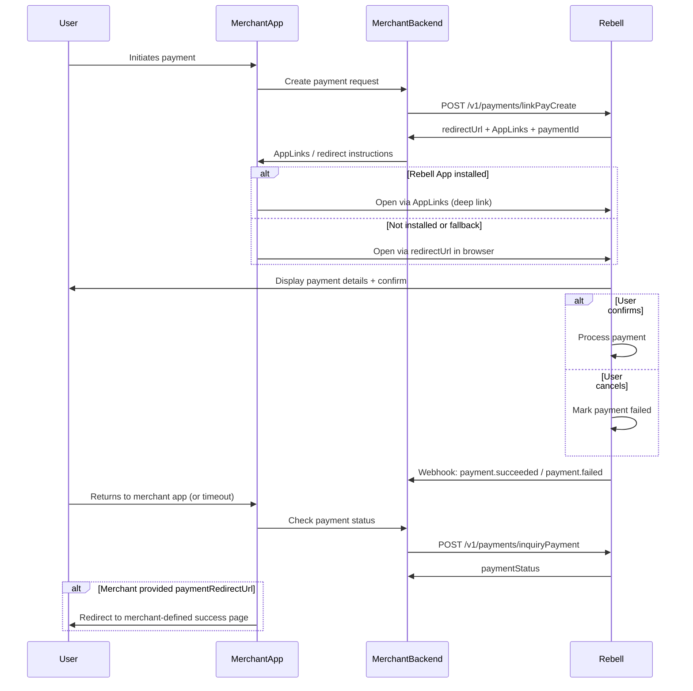

Link Pay is a **user-initiated, app-to-app or browser-to-app** payment flow. The merchant backend creates a payment request and receives a redirect URL (or deep link) that sends the user to the Rebell SuperApp, where they authorize the payment. The user is then returned to the merchant application or website.

This flow is ideal for **mobile apps**, **web checkout**, and **hybrid experiences** where the merchant wants Rebell to handle the payment UI.

## When to Use Link Pay

<Tabs>
  <Tab title="Best For">
    **Ideal use cases:**

    - User interacts through a **mobile app** or **mobile web** flow
    - Merchant wants to offload the payment UI to Rebell
    - Flow requires strong user authentication within the SuperApp
    - Checkout should redirect seamlessly to Rebell and return afterward

    **Common scenarios:**
    - App-based purchases
    - Web checkout (scan-to-app or auto redirect)
    - Subscription or recurring services (first-time payment)
    - On-demand services (mobility, taxis, ride-hailing)
    - Digital goods or top-up flows
  </Tab>

  <Tab title="Not Suitable For">
    **Use different flows for:**

    - ❌ In-store POS transactions
    - ❌ Merchant-initiated payments
    - ❌ Static QR code payments
    - ❌ Environments where user cannot be redirected

    Consider [Retail Pay](/payment-integration/retail-pay) or [QR Order Pay](/payment-integration/qr-order-pay) for these scenarios.
  </Tab>
</Tabs>

## Payment Flow

<Steps>
  <Step title="User Initiates Checkout">
    User initiates checkout in the merchant app or website
  </Step>

  <Step title="Create Link Pay Order">
    Merchant backend calls Rebell `linkPayCreate` API
  </Step>

  <Step title="Receive Redirect URLs">
    Rebell responds with:
    - A redirect URL (deep link)
    - App-to-app deep links (Android / iOS)
    - Optional fallback links (browser-based)
  </Step>

  <Step title="Redirect User">
    Merchant redirects the user to Rebell using the appropriate link
  </Step>

  <Step title="User Confirms Payment">
    User reviews and confirms payment inside the Rebell SuperApp
  </Step>

  <Step title="Process Payment">
    Rebell processes the transaction
  </Step>

  <Step title="Webhook Notification">
    Merchant receives webhook notification with the final payment status
  </Step>

  <Step title="Complete Order">
    Merchant app or website updates the UI and completes the order
  </Step>
</Steps>

## Sequence Diagram



## API Specification

### Endpoint

```
POST /v1/payments/linkPayCreate
```

### Request Headers

Include standard [authentication headers](/payment-integration/authentication-environments):

```http
Client-Id: your-client-id
Request-Time: 2024-01-10T12:22:30Z
Signature: algorithm=SHA256withRSA, keyVersion=1, signature=...
Content-Type: application/json
```

### Request Body

<ParamField path="productCode" type="string" required>
  Payment product type assigned by Rebell
</ParamField>

<ParamField path="paymentRequestId" type="string" required>
  Merchant-generated unique ID (idempotency key). Must be unique per transaction.
</ParamField>

<ParamField path="paymentAmount" type="object" required>
  Payment amount details

  <Expandable title="properties">
    <ParamField path="currency" type="string" required>
      Always "EUR"
    </ParamField>

    <ParamField path="value" type="integer" required>
      Amount in minor units (e.g., 499 → €4.99)
    </ParamField>
  </Expandable>
</ParamField>

<ParamField path="order" type="object">
  Order details

  <Expandable title="properties">
    <ParamField path="orderDescription" type="string">
      Description shown in Rebell confirmation UI
    </ParamField>

    <ParamField path="merchant.store.externalStoreId" type="string">
      Store or branch ID for multi-store setups
    </ParamField>
  </Expandable>
</ParamField>

<ParamField path="settlementStrategy" type="object">
  Settlement configuration

  <Expandable title="properties">
    <ParamField path="settlementCurrency" type="string">
      Settlement currency (e.g., "EUR")
    </ParamField>
  </Expandable>
</ParamField>

**Example Request:**

```json
{
  "productCode": "51051000101000100040",
  "paymentRequestId": "checkout-20240321-987",
  "paymentAmount": {
    "currency": "EUR",
    "value": 499
  },
  "order": {
    "orderDescription": "Monthly subscription - Premium plan",
    "merchant": {
      "store": {
        "externalStoreId": "STORE-77"
      }
    }
  },
  "settlementStrategy": {
    "settlementCurrency": "EUR"
  }
}
```

### Response Parameters

<ResponseField name="result" type="object" required>
  Result details

  <Expandable title="properties">
    <ResponseField name="resultCode" type="string">
      Result code (SUCCESS, FAIL, etc.)
    </ResponseField>

    <ResponseField name="resultStatus" type="string">
      Status indicator: "S" (success), "F" (fail)
    </ResponseField>
  </Expandable>
</ResponseField>

<ResponseField name="redirectUrl" type="string">
  Deep link to open Rebell SuperApp directly
</ResponseField>

<ResponseField name="appLinks" type="object">
  Platform-specific app link metadata

  <Expandable title="properties">
    <ResponseField name="android" type="object">
      Android-specific link data including `applicationId`, `targetPath`, and `shortUrl`
    </ResponseField>

    <ResponseField name="ios" type="object">
      iOS-specific link data including `bundleId`, `targetPath`, and `shortUrl`
    </ResponseField>
  </Expandable>
</ResponseField>

<ResponseField name="paymentId" type="string">
  Payment identifier to be used for inquiry or reconciliation
</ResponseField>

**Example Response:**

```json
{
  "result": {
    "resultCode": "SUCCESS",
    "resultStatus": "S"
  },
  "redirectUrl": "rebell://pay?orderToken=abcedf123...",
  "appLinks": {
    "android": {
      "applicationId": "com.rebell.superapp",
      "targetPath": "pay",
      "shortUrl": "https://app.rebell.com/p/abc123"
    },
    "ios": {
      "bundleId": "com.rebell.superapp",
      "targetPath": "pay",
      "shortUrl": "https://app.rebell.com/p/abc123"
    }
  },
  "paymentId": "2024032100123456"
}
```

## Redirect Logic

<Warning>
**Critical Implementation Detail**

Merchant frontend must implement a structured redirect strategy based on the user's device and context.
</Warning>

<Tabs>
  <Tab title="Mobile App (Native)">
    **For users on native mobile apps:**

    Use one of the following:
    - `redirectUrl` (deep link)
    - `appLinks.android.shortUrl` (Android)
    - `appLinks.ios.shortUrl` (iOS)

    ```javascript
    // React Native example
    import { Linking, Platform } from 'react-native';

    async function redirectToRebell(response) {
      const url = Platform.select({
        ios: response.appLinks.ios.shortUrl,
        android: response.appLinks.android.shortUrl,
        default: response.redirectUrl
      });

      const canOpen = await Linking.canOpenURL(url);
      if (canOpen) {
        await Linking.openURL(url);
      }
    }
    ```
  </Tab>

  <Tab title="Mobile Browser">
    **For users on mobile web:**

    - Use `shortUrl` if available
    - Fallback to universal link
    - If app not installed → trigger store installation
    - After installation → link auto-resolves back to payment screen

    ```javascript
    function redirectToRebell(response, platform) {
      const shortUrl = platform === 'ios'
        ? response.appLinks.ios.shortUrl
        : response.appLinks.android.shortUrl;

      // shortUrl handles app-not-installed fallback automatically
      window.location.href = shortUrl || response.redirectUrl;
    }
    ```
  </Tab>

  <Tab title="Desktop Browser">
    **For users on desktop:**

    Options:
    - Display a QR code containing the `shortUrl`
    - Offer "Send link to mobile device" flow
    - Provide fallback manual instructions

    ```javascript
    import QRCode from 'qrcode';

    async function showDesktopCheckout(response) {
      const shortUrl = response.appLinks.android.shortUrl;

      // Render QR code for mobile scanning
      const canvas = document.getElementById('qr-canvas');
      await QRCode.toCanvas(canvas, shortUrl, { width: 300 });

      // Show instructions
      showMessage('Scan with your phone to complete payment');
    }
    ```
  </Tab>
</Tabs>

## Merchant Behavior Rules

### Merchant MUST

<Checks>
  - Generate a unique `paymentRequestId` per transaction
  - Store the `paymentId` / `paymentRequestId` pair
  - Redirect the user to Rebell **immediately** after receiving the link
  - Wait for webhook as the **source of truth**
  - Implement inquiry retry logic if webhook is delayed
</Checks>

### Merchant MUST NOT

<Warning>
**Critical Don'ts:**

- ❌ Allow `paymentRequestId` reuse
- ❌ Embed private keys in frontend code
- ❌ Infer payment status from redirect return URL only
- ❌ Treat the initial Link Pay API response as final
</Warning>

## Handling Payment Completion

### Upon Receiving Webhook SUCCESS

<Check>
**Payment completed successfully**

Actions to take:
- Mark order as PAID in your system
- Redirect user to success screen
- Trigger fulfillment flow
- Send confirmation to customer
</Check>

### Upon Receiving Webhook FAIL

<Error>
**Payment failed or canceled**

Possible causes:
- User rejected the payment
- Risk/AML screening failure
- Payment expired
- Payment instrument invalid

**Merchant should:**
- Display "Payment failed" or "Try again" message
- Provide retry option via new Link Pay request
- Offer alternative payment methods
</Error>

## Error Scenarios & Recovery

<AccordionGroup>
  <Accordion title="ORDER_STATUS_INVALID">
    **Cause:** Order in invalid or closed state

    **Recovery:**
    - Generate a new `paymentRequestId`
    - Ensure backend order lifecycle is correct
    - Verify order hasn't already been paid or canceled
  </Accordion>

  <Accordion title="PAYMENT_IN_PROCESS">
    **Cause:** Another payment is already processing for the same request

    **Recovery:**
    - Use inquiry API to check existing payment status
    - Prevent duplicate link generation
    - Wait for the current payment to complete or fail
  </Accordion>

  <Accordion title="NEED_RISK_CHALLENGE">
    **Cause:** User must complete additional verification inside Rebell

    **Recovery:**
    - Display: "Please complete verification in Rebell"
    - Wait for webhook notification
    - Do not retry or create new payment request
  </Accordion>

  <Accordion title="PROCESS_FAIL">
    **Cause:** Internal processing failure

    **Recovery:**
    - Retry with the same `paymentRequestId` (idempotent)
    - If retries fail, wait and try again later
    - Contact support if issue persists
  </Accordion>

  <Accordion title="User Returns Without Completing">
    **Cause:** User closed the app or navigated away before completing

    **Recovery:**
    - Check payment status via inquiry API
    - If still pending, allow user to retry redirect
    - Payment may still complete via webhook
  </Accordion>
</AccordionGroup>

## Security Considerations

<Warning>
**Security Best Practices:**

- ✅ Do not expose backend logic in redirect URLs
- ✅ Always verify webhook signatures before updating order status
- ✅ Keep redirect URL tokens confidential
- ✅ Ensure environment separation (sandbox vs production)
- ✅ Validate user session before creating Link Pay order
- ✅ Never store or log sensitive payment tokens
- ✅ Use HTTPS for all communications
</Warning>

## UX Recommendations

Create optimal experiences based on the user's context:

<Tabs>
  <Tab title="Mobile Apps">
    **For merchant mobile apps:**

    - Auto-redirect without confirmation prompt
    - Show loading spinner until redirect is handled
    - After return, display pending state until webhook arrives
    - Handle app-not-installed gracefully
  </Tab>

  <Tab title="Websites">
    **For merchant websites:**

    - Detect device type (mobile vs desktop)
    - On desktop, display QR code version of the `redirectUrl`
    - On mobile browser, use `shortUrl` for automatic handling
    - Show clear progress indicators
  </Tab>

  <Tab title="Messaging">
    **Recommended user messages:**

    - "You are being redirected to Rebell for secure payment."
    - "Waiting for payment confirmation..."
    - "Payment complete — returning to merchant app."
    - "Unable to open Rebell. Please ensure the app is installed."
  </Tab>
</Tabs>

## Implementation Example

Here's a complete implementation example:

```javascript Complete Flow Example
// Backend: Create Link Pay order
app.post('/api/checkout/link-pay', async (req, res) => {
  const { orderId } = req.body;
  const order = await getOrder(orderId);

  const response = await rebellAPI.linkPayCreate({
    productCode: process.env.REBELL_PRODUCT_CODE,
    paymentRequestId: `checkout-${order.id}-${Date.now()}`,
    paymentAmount: {
      currency: 'EUR',
      value: order.totalCents
    },
    order: {
      orderDescription: order.description,
      merchant: {
        store: {
          externalStoreId: process.env.STORE_ID
        }
      }
    },
    settlementStrategy: {
      settlementCurrency: 'EUR'
    }
  });

  // Store payment reference
  await updateOrder(order.id, {
    paymentId: response.paymentId,
    paymentRequestId: `checkout-${order.id}-${Date.now()}`,
    status: 'pending_payment'
  });

  res.json({
    redirectUrl: response.redirectUrl,
    appLinks: response.appLinks,
    paymentId: response.paymentId
  });
});

// Frontend: Handle redirect
async function initiatePayment(orderId) {
  const response = await fetch('/api/checkout/link-pay', {
    method: 'POST',
    body: JSON.stringify({ orderId })
  }).then(r => r.json());

  // Detect platform and redirect
  const isMobile = /iPhone|iPad|Android/i.test(navigator.userAgent);
  const isIOS = /iPhone|iPad/i.test(navigator.userAgent);

  if (isMobile) {
    const url = isIOS
      ? response.appLinks.ios.shortUrl
      : response.appLinks.android.shortUrl;
    window.location.href = url;
  } else {
    // Show QR code for desktop users
    showQRCode(response.appLinks.android.shortUrl);
  }

  // Start polling for status
  pollPaymentStatus(orderId);
}

// Frontend: Poll for payment completion
async function pollPaymentStatus(orderId) {
  const maxAttempts = 60; // 5 minutes with 5-second intervals
  let attempts = 0;

  while (attempts < maxAttempts) {
    await new Promise(resolve => setTimeout(resolve, 5000));

    const order = await fetch(`/api/orders/${orderId}`).then(r => r.json());

    if (order.status === 'paid') {
      showSuccess('Payment completed!');
      return;
    } else if (order.status === 'failed') {
      showError('Payment failed. Please try again.');
      return;
    }

    attempts++;
  }
}

// Webhook handler
app.post('/webhooks/rebell', async (req, res) => {
  // Verify signature
  if (!verifySignature(req)) {
    return res.status(401).send('Invalid signature');
  }

  const { paymentRequestId, result } = req.body;

  if (result.resultStatus === 'S') {
    await updateOrderByPaymentRequestId(paymentRequestId, { status: 'paid' });
    await fulfillOrder(paymentRequestId);
  } else {
    await updateOrderByPaymentRequestId(paymentRequestId, { status: 'failed' });
  }

  res.status(200).send('OK');
});
```

## Testing Checklist

Test these scenarios in sandbox before going live:

<Checks>
  - Create Link Pay and complete payment successfully
  - User cancellation scenario
  - App-not-installed fallback flow
  - Desktop QR code flow
  - Mobile browser redirect flow
  - Webhook delivery and signature verification
  - Duplicate request handling (idempotency)
  - Risk challenge flow (NEED_RISK_CHALLENGE)
  - User returns before payment completion
  - Timeout and retry scenarios
  - Multiple payment attempts for same order
</Checks>

## Next Steps

<CardGroup cols={2}>
  <Card title="Webhooks" icon="webhook" href="/payment-integration/webhooks">
    Implement webhook handlers for payment notifications
  </Card>

  <Card title="Inquiring Payment API" icon="magnifying-glass" href="/payment-integration/inquiring-payment-api">
    Poll payment status as alternative to webhooks
  </Card>

  <Card title="QR Order Pay" icon="qrcode" href="/payment-integration/qr-order-pay">
    Alternative flow where user scans merchant's QR code
  </Card>

  <Card title="Error Handling" icon="triangle-exclamation" href="/payment-integration/error-handling">
    Complete error codes reference
  </Card>
</CardGroup>
