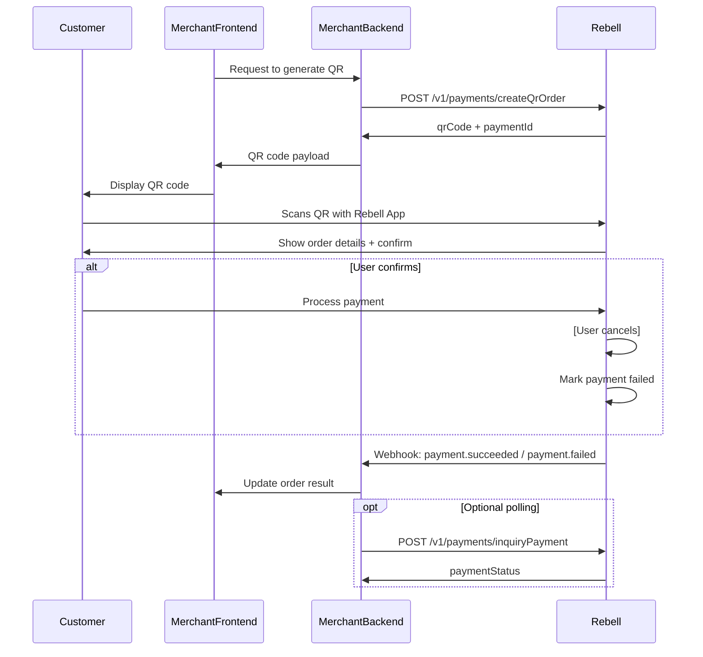

QR Order Pay is a **user-initiated** payment flow in which the merchant generates a QR code containing an order or transaction request. The user scans this QR code using the Rebell SuperApp and completes the payment within the app.

This flow works for both **static QR codes** (fixed merchant reference) and **dynamic QR codes** (unique order-specific QR). It is ideal for unattended or user-driven scenarios and enables seamless payments without POS hardware.

## When to Use QR Order Pay

<Tabs>
  <Tab title="Best For">
    **Ideal use cases:**

    - Payment is initiated by the **user**, not the merchant
    - No POS hardware available
    - Hands-off checkout flow desired
    - Printed or digital QR codes
    - Desktop QR checkout support needed

    **Common scenarios:**
    - Restaurants (table QR)
    - Cafés and takeaway counters
    - Parking machines / mobility services
    - Self-service kiosks without scanner hardware
    - Digital invoices or screens
    - E-commerce desktop checkout (scan-to-pay)
  </Tab>

  <Tab title="QR Types">
    **Dynamic QR Codes:**
    - Generated per order/transaction
    - Contains specific amount and order details
    - Limited validity (typically 5 minutes)
    - Most common for checkout flows

    **Static QR Codes:**
    - Fixed merchant reference
    - No amount pre-filled
    - User enters amount or selects items
    - Ideal for unattended environments
  </Tab>
</Tabs>

## Payment Flow

<Steps>
  <Step title="Create Order">
    Merchant creates an order on their backend system
  </Step>

  <Step title="Generate QR Code">
    Merchant backend calls Rebell `createQrOrder` API
  </Step>

  <Step title="Display QR">
    Rebell responds with a QR code payload to be rendered on screen or printed
  </Step>

  <Step title="User Scans">
    User scans the QR code with the Rebell SuperApp
  </Step>

  <Step title="User Confirms">
    The app displays the order and requests confirmation from the user
  </Step>

  <Step title="Process Payment">
    Rebell processes the payment
  </Step>

  <Step title="Webhook Notification">
    Rebell sends webhook notification to the merchant backend
  </Step>

  <Step title="Complete Order">
    Merchant backend confirms order and completes the business flow
  </Step>
</Steps>

## Sequence Diagram



## API Specification

### Endpoint

```
POST /v1/payments/createQrOrder
```

### Request Headers

Include standard [authentication headers](/payment-integration/authentication-environments):

```http
Client-Id: your-client-id
Request-Time: 2024-01-10T12:22:30Z
Signature: algorithm=SHA256withRSA, keyVersion=1, signature=...
Content-Type: application/json
```

### Request Body

<ParamField path="productCode" type="string" required>
  Payment product type assigned by Rebell
</ParamField>

<ParamField path="paymentRequestId" type="string" required>
  Unique order identifier (idempotency key). Must be unique per transaction.
</ParamField>

<ParamField path="paymentAmount" type="object" required>
  Payment amount details

  <Expandable title="properties">
    <ParamField path="currency" type="string" required>
      Currently "EUR"
    </ParamField>

    <ParamField path="value" type="integer" required>
      Amount in minor units (e.g., 2599 → €25.99)
    </ParamField>
  </Expandable>
</ParamField>

<ParamField path="order" type="object">
  Order details

  <Expandable title="properties">
    <ParamField path="orderDescription" type="string">
      Shown in user confirmation screen
    </ParamField>

    <ParamField path="merchant.store.externalStoreId" type="string">
      Useful for multi-store merchants
    </ParamField>
  </Expandable>
</ParamField>

**Example Request:**

```json
{
  "productCode": "51051000101000100040",
  "paymentRequestId": "order-20240321-001",
  "paymentAmount": {
    "currency": "EUR",
    "value": 2599
  },
  "order": {
    "orderDescription": "Parking - Zone 12",
    "merchant": {
      "store": {
        "externalStoreId": "STORE-123"
      }
    }
  }
}
```

### Response Parameters

<ResponseField name="result" type="object" required>
  Result details

  <Expandable title="properties">
    <ResponseField name="resultCode" type="string">
      Result code (SUCCESS, FAIL, etc.)
    </ResponseField>

    <ResponseField name="resultStatus" type="string">
      Status indicator: "S" (success), "F" (fail)
    </ResponseField>
  </Expandable>
</ResponseField>

<ResponseField name="qrCode" type="string" required>
  QR code payload string (NOT an image). Must be rendered using a QR library.
</ResponseField>

**Example Response:**

```json
{
  "result": {
    "resultCode": "SUCCESS",
    "resultStatus": "S"
  },
  "qrCode": "CGCP://bizType=PAY&version=1&...encoded payload..."
}
```

<Warning>
**Important Notes:**

- `qrCode` is a **string payload**, NOT an image
- Merchant must render it using a QR library (SVG/canvas/img)
- Payload encoding is handled by Rebell and **must not be altered**
</Warning>

## Rendering the QR Code

The API returns a string payload that you must render into a visual QR code:

<CodeGroup>

```javascript JavaScript/React
import QRCode from 'qrcode';

async function renderQR(qrCodePayload) {
  // Render to canvas
  const canvas = document.getElementById('qr-canvas');
  await QRCode.toCanvas(canvas, qrCodePayload, {
    width: 300,
    margin: 2,
    errorCorrectionLevel: 'M'
  });

  // Or render to data URL
  const dataUrl = await QRCode.toDataURL(qrCodePayload);
  document.getElementById('qr-image').src = dataUrl;
}
```

```python Python
from qrcode import QRCode
import qrcode.image.svg

def render_qr(qr_code_payload):
    # Generate QR code
    qr = QRCode(
        version=1,
        error_correction=qrcode.constants.ERROR_CORRECT_M,
        box_size=10,
        border=4,
    )
    qr.add_data(qr_code_payload)
    qr.make(fit=True)

    # Create image
    img = qr.make_image(fill_color="black", back_color="white")
    img.save("qr_code.png")
```

```java Java
import com.google.zxing.BarcodeFormat;
import com.google.zxing.qrcode.QRCodeWriter;
import com.google.zxing.client.j2se.MatrixToImageWriter;

public void renderQR(String qrCodePayload) throws Exception {
    QRCodeWriter qrCodeWriter = new QRCodeWriter();
    BitMatrix bitMatrix = qrCodeWriter.encode(
        qrCodePayload,
        BarcodeFormat.QR_CODE,
        300,
        300
    );

    Path path = Paths.get("qr_code.png");
    MatrixToImageWriter.writeToPath(bitMatrix, "PNG", path);
}
```

</CodeGroup>

## Merchant Behavior Rules

### Merchant MUST

<Checks>
  - Render the QR code exactly as provided
  - Store `paymentRequestId` and associate it with the order
  - Wait for the webhook to confirm payment result
  - Optionally display a "Waiting for confirmation..." indicator
  - Automatically update the UI when payment completes
</Checks>

### Merchant MUST NOT

<Warning>
**Critical Don'ts:**

- ❌ Reuse a previously generated QR code for a different order
- ❌ Modify or shorten the QR payload
- ❌ Generate QR codes client-side (always via backend)
- ❌ Rely on the Rebell API response alone — webhook is the final authority
</Warning>

## Handling Payment Completion

### Upon Receiving Webhook SUCCESS

<Check>
**Payment completed successfully**

Actions to take:
- Mark the order as paid in your system
- Update frontend (web/mobile/table display)
- Proceed with order fulfillment
- Send confirmation to customer (email, SMS, etc.)
</Check>

### Upon Receiving Webhook FAIL

<Error>
**Payment failed or canceled**

Possible reasons:
- User canceled the payment
- Risk failure
- Expired QR code
- Payment method not available
- Insufficient funds

**Merchant should:**
- Allow user to retry with a new QR
- Optionally refresh QR for a new session
- Display clear failure message
</Error>

## Error Scenarios & Recovery

<AccordionGroup>
  <Accordion title="QR Expired">
    **ResultCode:** `QR_EXPIRED`

    **Cause:** User scans a QR long after creation (typically > 5 minutes)

    **Recovery:**
    - Generate a fresh QR code with a new API call
    - Display "QR code expired, please refresh" message
    - Implement auto-refresh mechanism for dynamic QR
  </Accordion>

  <Accordion title="Invalid QR Payload">
    **ResultCode:** `INVALID_QR_CODE`

    **Causes:**
    - Wrong encoding used when rendering
    - Resizing too aggressively (QR became unreadable)
    - Using lossy image formats

    **Recovery:**
    - Use error correction level 'M' or 'H'
    - Ensure minimum size of 200x200px
    - Use PNG or SVG format (not JPEG)
    - Don't modify the payload string
  </Accordion>

  <Accordion title="Amount Mismatch">
    **ResultCode:** `ORDER_AMOUNT_INVALID`

    **Cause:** Merchant changes the amount after QR generation

    **Fix:**
    - Always generate a new QR for updated amounts
    - Never reuse QR codes for different amounts
    - Implement order amount locking
  </Accordion>

  <Accordion title="User Rejects Payment">
    **ResultCode:** `PAYMENT_REJECTED`

    **Cause:** User explicitly cancels in the app

    **Recovery:**
    - Display: "Payment not completed"
    - Offer option to generate new QR
    - Allow alternative payment methods
  </Accordion>

  <Accordion title="Risk / Compliance Issues">
    **ResultCode:** `RISK_REJECT`

    **Cause:** Payment blocked by risk/fraud controls

    **Recovery:**
    - Encourage user to try another payment method
    - Contact support if issue persists
    - Don't retry automatically
  </Accordion>
</AccordionGroup>

## Security Considerations

<Warning>
**Security Best Practices:**

- ✅ QR codes should not expose sensitive merchant logic
- ✅ Do not embed personal data in order description
- ✅ Always generate QR codes server-side (never client-side)
- ✅ Verify webhook signatures before updating order status
- ✅ Keep QR validity time limited (recommended < 5 minutes for dynamic QR)
- ✅ Implement rate limiting on QR generation
- ✅ Log QR generation attempts for fraud monitoring
</Warning>

## UX Recommendations

Create optimal user experiences for different QR types:

<Tabs>
  <Tab title="Dynamic QR">
    **For order-specific QR codes:**

    - Show a countdown timer (optional)
    - Auto-refresh QR every few minutes if needed
    - Display order amount prominently
    - Allow user to retry easily
    - Show "Scan with Rebell to pay" instruction
    - Update UI immediately on webhook receipt
  </Tab>

  <Tab title="Static QR">
    **For merchant-only QR codes:**

    - Ideal for unattended environments
    - Must direct user to a server-side order creation mechanism
    - Display merchant name clearly for trust
    - Include logo or branding
    - Provide fallback contact information
  </Tab>

  <Tab title="Desktop Checkout">
    **For e-commerce scan-to-pay:**

    - Present QR prominently in checkout flow
    - Show clear "Scan with Rebell to Pay" message
    - Display payment amount next to QR
    - After webhook, auto-update page to "Payment Successful"
    - Provide alternative payment buttons
    - Don't block other payment options
  </Tab>
</Tabs>

### Mobile Web Considerations

<Info>
If the user is on mobile web, consider offering a direct app link instead of QR code:

```html
<a href="rebellapp://pay?code=...">Pay with Rebell App</a>
```

This provides better UX than asking mobile users to scan a QR on their own device.
</Info>

## Testing Checklist

Test these scenarios in sandbox before going live:

<Checks>
  - Generate dynamic QR and complete payment
  - Generate static QR (if applicable)
  - QR expiration handling (wait > 5 minutes)
  - Invalid QR rendering recovery
  - User cancellation scenario
  - Webhook delivery and signature verification
  - Multiple concurrent QR codes
  - QR refresh mechanism
  - Desktop checkout flow
  - Mobile web deep linking
  - Auto-update UI on payment completion
</Checks>

## Implementation Example

Here's a complete implementation example:

```javascript Complete Flow Example
// Backend: Generate QR
app.post('/api/orders/:orderId/qr', async (req, res) => {
  const order = await getOrder(req.params.orderId);

  const response = await rebellAPI.createQrOrder({
    productCode: process.env.REBELL_PRODUCT_CODE,
    paymentRequestId: `order-${order.id}`,
    paymentAmount: {
      currency: 'EUR',
      value: order.totalCents
    },
    order: {
      orderDescription: order.description,
      merchant: {
        store: {
          externalStoreId: process.env.STORE_ID
        }
      }
    }
  });

  // Store QR code reference
  await updateOrder(order.id, {
    qrCode: response.qrCode,
    paymentRequestId: `order-${order.id}`,
    status: 'pending_payment'
  });

  res.json({ qrCode: response.qrCode });
});

// Frontend: Render QR
async function displayCheckout(orderId) {
  const { qrCode } = await fetch(`/api/orders/${orderId}/qr`).then(r => r.json());

  // Render QR code
  const canvas = document.getElementById('qr-canvas');
  await QRCode.toCanvas(canvas, qrCode, { width: 300 });

  // Poll for payment status (optional)
  const interval = setInterval(async () => {
    const order = await fetch(`/api/orders/${orderId}`).then(r => r.json());

    if (order.status === 'paid') {
      clearInterval(interval);
      showSuccess();
    } else if (order.status === 'failed') {
      clearInterval(interval);
      showError();
    }
  }, 3000);
}

// Webhook handler
app.post('/webhooks/rebell', async (req, res) => {
  // Verify signature
  if (!verifySignature(req)) {
    return res.status(401).send('Invalid signature');
  }

  const { paymentRequestId, result } = req.body;
  const orderId = paymentRequestId.replace('order-', '');

  if (result.resultStatus === 'S') {
    await updateOrder(orderId, { status: 'paid' });
    await fulfillOrder(orderId);
  } else {
    await updateOrder(orderId, { status: 'failed' });
  }

  res.status(200).send('OK');
});
```

## Next Steps

<CardGroup cols={2}>
  <Card title="Webhooks" icon="webhook" href="/payment-integration/webhooks">
    Implement webhook handlers for payment notifications
  </Card>

  <Card title="Inquiring Payment API" icon="magnifying-glass" href="/payment-integration/inquiring-payment-api">
    Poll payment status as alternative to webhooks
  </Card>

  <Card title="Link Pay" icon="link" href="/payment-integration/link-pay">
    Alternative mobile app-to-app payment flow
  </Card>

  <Card title="Error Handling" icon="triangle-exclamation" href="/payment-integration/error-handling">
    Complete error codes reference
  </Card>
</CardGroup>
