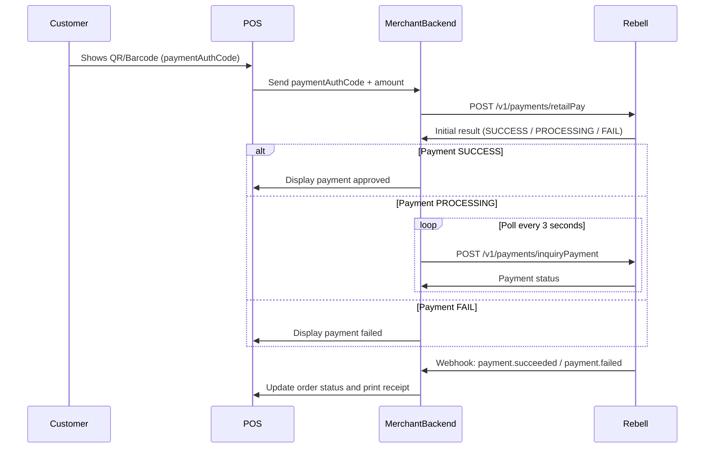

Retail Pay is a merchant-initiated payment flow in which the merchant scans a dynamic code displayed by the user inside the Rebell SuperApp. The merchant backend uses the scanned `paymentAuthCode` to create and authorize a payment request through Rebell's Payment API.

This flow is designed for **in-store payments**, **POS systems**, **kiosks**, and any **physical checkout environment** where the merchant initiates the transaction.

## When to Use Retail Pay

<Tabs>
  <Tab title="Best For">
    **Ideal use cases:**

    - In-store POS systems with barcode scanners
    - Mobile POS applications
    - Self-service kiosks
    - Physical checkout counters
    - Fast, real-time authorization flows
    - Alipay/WeChat "scan-to-pay" style experience
  </Tab>

  <Tab title="Not Suitable For">
    **Use different flows for:**

    - ❌ Web checkout experiences
    - ❌ User-initiated payment flows
    - ❌ Environments without scanning devices
    - ❌ Online-only transactions

    Consider [QR Order Pay](/payment-integration/qr-order-pay) or [Link Pay](/payment-integration/link-pay) for these scenarios.
  </Tab>
</Tabs>

## Payment Flow

<Steps>
  <Step title="User Displays Code">
    Customer opens the Rebell SuperApp and displays their dynamic payment code (QR or barcode)
  </Step>

  <Step title="Merchant Scans">
    Merchant POS or terminal scans the code to capture the `paymentAuthCode`
  </Step>

  <Step title="API Call">
    Merchant backend receives the `paymentAuthCode` and calls Rebell's Retail Pay API
  </Step>

  <Step title="Process Payment">
    Rebell processes the payment and returns:
    - `SUCCESS` (final)
    - `PROCESSING` (requires polling)
    - `FAIL` (rejected or invalid code)
  </Step>

  <Step title="Webhook Notification">
    Rebell sends a webhook notification with the final payment result
  </Step>

  <Step title="Complete Transaction">
    Merchant backend updates the POS and completes the sale
  </Step>
</Steps>

## Sequence Diagram



## API Specification

### Endpoint

```
POST /v1/payments/retailPay
```

### Request Headers

Include standard [authentication headers](/payment-integration/authentication-environments):

```http
Client-Id: your-client-id
Request-Time: 2024-01-10T12:22:30Z
Signature: algorithm=SHA256withRSA, keyVersion=1, signature=...
Content-Type: application/json
```

### Request Body

<ParamField path="productCode" type="string" required>
  Payment product type assigned by Rebell
</ParamField>

<ParamField path="paymentRequestId" type="string" required>
  Merchant-generated unique ID (idempotency key). Must be unique per transaction.
</ParamField>

<ParamField path="paymentAuthCode" type="string" required>
  Dynamic code scanned from the user's app
</ParamField>

<ParamField path="paymentAmount" type="object" required>
  Payment amount details

  <Expandable title="properties">
    <ParamField path="currency" type="string" required>
      Always "EUR"
    </ParamField>

    <ParamField path="value" type="integer" required>
      Amount in minor units (e.g., 1250 → €12.50)
    </ParamField>
  </Expandable>
</ParamField>

<ParamField path="order" type="object">
  Order details

  <Expandable title="properties">
    <ParamField path="orderDescription" type="string">
      Description shown on merchant receipt
    </ParamField>

    <ParamField path="merchant.store.externalStoreId" type="string">
      Useful for multi-store setups
    </ParamField>
  </Expandable>
</ParamField>

**Example Request:**

```json
{
  "productCode": "51051000101000100040",
  "paymentRequestId": "pos-20240321-0001",
  "paymentAuthCode": "281012020262467128",
  "paymentAmount": {
    "currency": "EUR",
    "value": 1250
  },
  "order": {
    "orderDescription": "Cappuccino and croissant",
    "merchant": {
      "store": {
        "externalStoreId": "STORE-001"
      }
    }
  }
}
```

### Response Parameters

<ResponseField name="result" type="object" required>
  Payment result details

  <Expandable title="properties">
    <ResponseField name="resultCode" type="string">
      Result code (SUCCESS, PROCESSING, PAYMENT_FAIL, etc.)
    </ResponseField>

    <ResponseField name="resultStatus" type="string">
      Status indicator: "S" (success), "U" (unknown/processing), "F" (fail)
    </ResponseField>

    <ResponseField name="resultMessage" type="string">
      Human-readable error message (only present on failure)
    </ResponseField>
  </Expandable>
</ResponseField>

<ResponseField name="paymentId" type="string">
  Rebell's unique payment identifier (present on SUCCESS or PROCESSING)
</ResponseField>

**Response Examples:**

<CodeGroup>

```json Success
{
  "result": {
    "resultCode": "SUCCESS",
    "resultStatus": "S"
  },
  "paymentId": "20240321000123456789"
}
```

```json Processing
{
  "result": {
    "resultCode": "PROCESSING",
    "resultStatus": "U"
  },
  "paymentId": "20240321000123456789"
}
```

```json Failure
{
  "result": {
    "resultCode": "PAYMENT_FAIL",
    "resultStatus": "F",
    "resultMessage": "User balance insufficient"
  }
}
```

</CodeGroup>

## Handling Response Status

### When Rebell Returns SUCCESS

<Check>
**Payment is authorized and final**

- Payment is complete and settled
- You may immediately print receipt and deliver goods
- No need to wait for webhook (though you'll still receive one)
</Check>

### When Rebell Returns PROCESSING

<Warning>
**Payment is pending - action required**

Merchant MUST:
- Start polling `inquiryPayment` API every 3-5 seconds
- Continue polling for up to 30 seconds or until webhook is received
- Treat the payment as PENDING until resolved
- Display "Awaiting confirmation..." message on POS
</Warning>

```javascript Example Polling Logic
async function handleProcessingPayment(paymentId) {
  const maxAttempts = 10; // 30 seconds with 3-second intervals
  let attempts = 0;

  while (attempts < maxAttempts) {
    await new Promise(resolve => setTimeout(resolve, 3000)); // Wait 3 seconds

    const status = await inquiryPayment(paymentId);

    if (status.resultStatus === 'S') {
      return 'SUCCESS';
    } else if (status.resultStatus === 'F') {
      return 'FAILED';
    }

    attempts++;
  }

  return 'TIMEOUT'; // Webhook will provide final status
}
```

### When Rebell Returns FAIL

<Error>
**Payment rejected - transaction failed**

- Transaction failed (insufficient balance, user rejection, expired code, etc.)
- Reject the transaction immediately
- Request a different payment method from customer
- Do NOT retry with the same payment details
</Error>

## Error Scenarios & Recovery

<AccordionGroup>
  <Accordion title="Invalid or Expired Payment Code">
    **ResultCode:** `INVALID_CODE`

    **Cause:** The scanned `paymentAuthCode` is invalid or expired

    **Recovery:**
    - Ask the user to refresh their payment code in the SuperApp
    - Retry by scanning the new code
    - Payment codes typically expire after 60 seconds
  </Accordion>

  <Accordion title="Risk Review Required">
    **ResultCode:** `NEED_RISK_CHALLENGE`

    **Cause:** Rebell requires additional risk verification

    **Recovery:**
    - Display on POS: "Please confirm the payment in your app"
    - Wait for webhook notification or poll inquiry API
    - User must approve payment in their SuperApp
  </Accordion>

  <Accordion title="User Rejected Payment">
    **ResultCode:** `PAYMENT_REJECTED`

    **Cause:** User explicitly denied the transaction in the app

    **Recovery:**
    - Inform customer that payment was declined
    - Request alternative payment method
    - Do not retry automatically
  </Accordion>

  <Accordion title="Timeout / Connection Issues">
    **Cause:** Network error or timeout during API call

    **Recovery:**
    - Retry the request (safe due to `paymentRequestId` idempotency)
    - Never create a new `paymentRequestId` for the same transaction
    - If retries fail, wait for webhook notification
  </Accordion>
</AccordionGroup>

## Security Considerations

<Warning>
**Critical Security Requirements:**

- ✅ Always use HTTPS between POS → backend and backend → Rebell
- ✅ Never expose `paymentAuthCode` in logs publicly
- ✅ Use short `paymentRequestId` TTLs in your database
- ✅ Validate webhook signatures (see [Webhooks](/payment-integration/webhooks))
- ✅ Implement fraud checks (store/device mapping, rate limits)
- ✅ Ensure POS devices are in secure environments
</Warning>

### Best Practices

- Store `paymentAuthCode` only temporarily during transaction
- Log transaction attempts without exposing sensitive codes
- Implement device authentication for POS terminals
- Monitor for unusual scanning patterns or high failure rates
- Set transaction amount limits per merchant policy

## UX Recommendations

Create a smooth checkout experience:

<CardGroup cols={2}>
  <Card title="Visual Confirmation" icon="check">
    POS should visually confirm when scanning succeeded with clear feedback
  </Card>

  <Card title="Processing Indicator" icon="spinner">
    If PROCESSING, show a spinner with "Awaiting confirmation..." message
  </Card>

  <Card title="Error Messages" icon="triangle-exclamation">
    Display clear, actionable error messages when codes are expired or unreadable
  </Card>

  <Card title="Timeout Handling" icon="clock">
    Avoid blocking the cashier longer than 30-40 seconds. Offer alternatives.
  </Card>
</CardGroup>

**Optional enhancements:**
- Sound/vibration feedback when payment succeeds
- Automatic receipt printing on success
- Display payment amount before scanning for verification

## Testing Checklist

Before going live, test these scenarios in sandbox:

<Checks>
  - Successful payment with immediate SUCCESS response
  - Payment with PROCESSING status (test polling logic)
  - Invalid/expired payment code handling
  - Insufficient balance scenario
  - User rejection scenario
  - Network timeout and retry logic
  - Webhook delivery and signature verification
  - Duplicate request handling (idempotency)
  - Multi-store setup (if applicable)
</Checks>

## Next Steps

<CardGroup cols={2}>
  <Card title="Inquiring Payment API" icon="magnifying-glass" href="/payment-integration/inquiring-payment-api">
    Learn how to poll payment status for PROCESSING transactions
  </Card>

  <Card title="Webhooks" icon="webhook" href="/payment-integration/webhooks">
    Implement webhook handlers for final payment notifications
  </Card>

  <Card title="Error Handling" icon="triangle-exclamation" href="/payment-integration/error-handling">
    Complete reference for error codes and recovery strategies
  </Card>

  <Card title="QR Order Pay" icon="qrcode" href="/payment-integration/qr-order-pay">
    Alternative flow where user scans merchant's QR code
  </Card>
</CardGroup>
