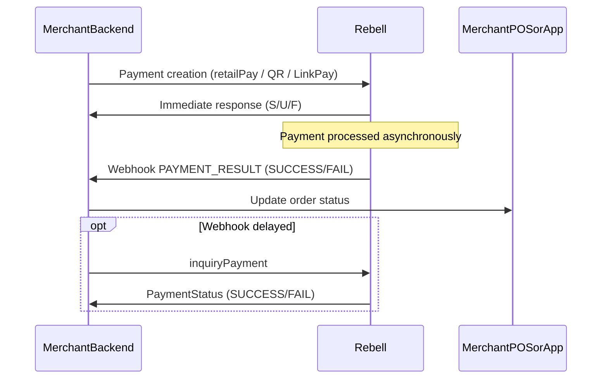

Webhooks are the **primary mechanism** used by Rebell to notify merchant backends about final payment results and relevant state changes.

While synchronous API responses (e.g., `retailPay`, `createQrOrder`, `linkPayCreate`) provide immediate feedback, **webhooks are the source of truth** for payment outcomes.

<Info>
This guide covers how to implement webhook endpoints, verify their authenticity, handle retries, and integrate webhook events into your order management logic.
</Info>

## Why Webhooks Are Required

Rebell uses webhooks to:

- Deliver **final payment results** (SUCCESS / FAIL)
- Notify merchants about **asynchronous status changes** after PROCESSING
- Provide a reliable, push-based channel for transaction updates

Webhooks are essential because of:

- Network instability between merchant and Rebell
- User actions happening after the initial API call
- Risk checks that complete asynchronously
- Multi-step payment approval flows

## Webhook Endpoint Requirements

Your backend must expose an HTTPS endpoint capable of:

<Checks>
  - Receiving POST requests with JSON payload
  - Validating Rebell's RSA signature
  - Returning HTTP 2xx status on successful processing
  - Handling retries idempotently
  - Responding quickly (under 2 seconds)
</Checks>

**Example endpoint URLs:**

| Environment | URL |
|-------------|-----|
| Sandbox | `https://sandbox-merchant.com/rebell/webhook` |
| Production | `https://merchant.com/rebell/webhook` |

## Webhook Payload Structure

A typical payment webhook payload:

```json
{
  "eventType": "PAYMENT_RESULT",
  "paymentId": "2024032100123456",
  "paymentRequestId": "checkout-20240321-987",
  "paymentStatus": "SUCCESS",
  "paymentAmount": {
    "currency": "EUR",
    "value": 499
  },
  "paymentTime": "2024-03-21T10:15:33Z",
  "failureReason": null,
  "merchantData": {
    "externalStoreId": "STORE-77"
  }
}
```

### Field Definitions

| Field | Description |
|-------|-------------|
| `eventType` | Type of event (e.g., `PAYMENT_RESULT`) |
| `paymentId` | Rebell payment identifier |
| `paymentRequestId` | Merchant's original request/order ID |
| `paymentStatus` | `SUCCESS` or `FAIL` |
| `paymentAmount` | Payment amount and currency |
| `paymentTime` | Timestamp of finalization (ISO 8601) |
| `failureReason` | Reason for failure (if any) |
| `merchantData` | Optional merchant-related fields (store, terminal, etc.) |

## Webhook Signature Verification

Rebell signs webhook POST requests using RSA, similar to how merchants sign API requests.

### Request Headers

Webhook requests include:

- `Request-Time` header
- `Signature` header
- JSON body

### Signature Header Format

```
Signature: algorithm=SHA256withRSA, keyVersion=<n>, signature=<base64url>
```

### Verification Steps

<Steps>
  <Step title="Extract Headers and Body">
    Extract from the incoming request:
    - `Request-Time` header
    - `Signature` header
    - Raw JSON body
  </Step>

  <Step title="Rebuild Signing String">
    Reconstruct the signing string (mirroring inbound API logic):

    ```
    POST /<your_webhook_path>
    <Rebell-Client-Id>.<Request-Time>.<BODY>
    ```

    Where:
    - `HTTP_PATH` is your webhook path (e.g., `/rebell/webhook`)
    - `Request-Time` is the timestamp from the header
    - `BODY` is the raw JSON body
  </Step>

  <Step title="Verify Signature">
    Verify using Rebell's public key:
    - Algorithm: `SHA256withRSA`
    - Use the correct Rebell public key for the `keyVersion` specified
  </Step>

  <Step title="Validate Timestamp">
    Reject if `Request-Time` is older than a defined window (e.g., 10 minutes) to prevent replay attacks
  </Step>

  <Step title="Process Webhook">
    Only after successful verification, process the webhook event
  </Step>
</Steps>

<Warning>
**Important:** If signature verification fails, do **not** process the event. Log it and return a non-2xx HTTP code.
</Warning>

### Signature Verification Example

<CodeGroup>

```javascript Node.js
const crypto = require('crypto');

function verifyWebhookSignature(req, rebellPublicKey) {
  const requestTime = req.headers['request-time'];
  const signatureHeader = req.headers['signature'];
  const rawBody = req.rawBody; // Ensure you capture raw body

  // Parse signature header
  const signatureParts = {};
  signatureHeader.split(', ').forEach(part => {
    const [key, value] = part.split('=');
    signatureParts[key] = value;
  });

  const { algorithm, keyVersion, signature } = signatureParts;

  // Rebuild signing string
  const webhookPath = '/rebell/webhook';
  const signingString = `POST ${webhookPath}\n${requestTime}.${rawBody}`;

  // Verify signature
  const verifier = crypto.createVerify('SHA256');
  verifier.update(signingString);

  const signatureBuffer = Buffer.from(signature, 'base64url');
  const isValid = verifier.verify(rebellPublicKey, signatureBuffer);

  // Validate timestamp (10-minute window)
  const requestTimestamp = new Date(requestTime).getTime();
  const now = Date.now();
  const isTimestampValid = Math.abs(now - requestTimestamp) < 10 * 60 * 1000;

  return isValid && isTimestampValid;
}
```

```python Python
import base64
import hashlib
from datetime import datetime, timedelta
from cryptography.hazmat.primitives import hashes, serialization
from cryptography.hazmat.primitives.asymmetric import padding

def verify_webhook_signature(request, rebell_public_key_pem):
    request_time = request.headers.get('Request-Time')
    signature_header = request.headers.get('Signature')
    raw_body = request.data.decode('utf-8')

    # Parse signature header
    sig_parts = dict(part.split('=') for part in signature_header.split(', '))
    signature = sig_parts['signature']

    # Rebuild signing string
    webhook_path = '/rebell/webhook'
    signing_string = f"POST {webhook_path}\n{request_time}.{raw_body}"

    # Load public key
    public_key = serialization.load_pem_public_key(rebell_public_key_pem.encode())

    # Verify signature
    try:
        signature_bytes = base64.urlsafe_b64decode(signature)
        public_key.verify(
            signature_bytes,
            signing_string.encode(),
            padding.PKCS1v15(),
            hashes.SHA256()
        )
        signature_valid = True
    except Exception:
        signature_valid = False

    # Validate timestamp (10-minute window)
    request_timestamp = datetime.fromisoformat(request_time.replace('Z', '+00:00'))
    timestamp_valid = abs((datetime.now(request_timestamp.tzinfo) - request_timestamp).total_seconds()) < 600

    return signature_valid and timestamp_valid
```

</CodeGroup>

## Sequence Diagram



## Idempotency & Repeated Deliveries

Webhooks are designed to be **at-least-once delivery**. This means the same event may be delivered **multiple times**.

<Warning>
**Critical Requirement**

Merchant webhook handlers **MUST** be idempotent:
- If `paymentId` already processed as SUCCESS → ignore repeated SUCCESS event
- If `paymentId` processed as FAIL → ignore repeated FAIL event
- Never process the same payment twice
- Lock or transact order state changes atomically (db transaction / row-level locking)
</Warning>

### Suggested Approach

<Steps>
  <Step title="Look Up Payment">
    Find the payment by `paymentId` or `paymentRequestId`
  </Step>

  <Step title="Check Status">
    If status is already FINAL (SUCCESS or FAIL), log and return HTTP 200
  </Step>

  <Step title="Update and Process">
    If status is not final, update it and proceed with business logic
  </Step>
</Steps>

## HTTP Response Rules

| Scenario | Response | Rebell Behavior |
|----------|----------|-----------------|
| Successful processing | HTTP 200 OK | No retry |
| Temporary error (DB lock, transient) | HTTP 5xx | Will retry |
| Invalid signature | HTTP 400/401 | Will retry |
| Permanent error | HTTP 4xx | May retry |

<Info>
**Performance Requirement**

Ensure your webhook endpoint responds quickly (under 2 seconds). Defer heavy processing to async workers if necessary to avoid timeouts.
</Info>

## Retry Policy

Rebell will retry webhook deliveries when:

- HTTP status is not 2xx
- Connection fails
- TLS error occurs

**Typical retry strategy:**

- Exponential backoff between retries
- Limited number of retries (e.g., over 24 hours)
- Retries stop once a 2xx response is received

**Merchants should:**

<Checks>
  - Design webhook handler as idempotent
  - Ensure endpoints are highly available
  - Monitor failures and implement alerting
  - Have fallback to Inquiry API if webhooks fail
</Checks>

## Complete Webhook Handler Example

<CodeGroup>

```javascript Node.js / Express
const express = require('express');
const app = express();

// Capture raw body for signature verification
app.use('/webhooks/rebell', express.json({
  verify: (req, res, buf) => {
    req.rawBody = buf.toString();
  }
}));

app.post('/webhooks/rebell', async (req, res) => {
  // 1. Verify signature
  if (!verifyWebhookSignature(req, REBELL_PUBLIC_KEY)) {
    console.error('Invalid webhook signature');
    return res.status(401).send('Invalid signature');
  }

  // 2. Parse payload
  const {
    eventType,
    paymentId,
    paymentRequestId,
    paymentStatus,
    paymentAmount,
    paymentTime,
    failureReason
  } = req.body;

  // 3. Handle event type
  if (eventType === 'PAYMENT_RESULT') {
    try {
      // Find existing payment/order
      const order = await db.orders.findOne({
        where: { paymentId }
      });

      if (!order) {
        console.error(`Order not found for paymentId: ${paymentId}`);
        return res.status(200).send('OK'); // Don't retry for unknown orders
      }

      // Idempotency check - already processed?
      if (order.status === 'paid' || order.status === 'failed') {
        console.log(`Duplicate webhook for paymentId: ${paymentId}, ignoring`);
        return res.status(200).send('OK');
      }

      // Update order status
      if (paymentStatus === 'SUCCESS') {
        await db.orders.update(
          {
            status: 'paid',
            paymentTime,
            paidAmount: paymentAmount.value
          },
          { where: { paymentId } }
        );

        // Trigger fulfillment (async)
        await fulfillmentQueue.add({ orderId: order.id });

        console.log(`Payment SUCCESS for order: ${order.id}`);
      } else {
        await db.orders.update(
          {
            status: 'failed',
            failureReason
          },
          { where: { paymentId } }
        );

        console.log(`Payment FAILED for order: ${order.id}, reason: ${failureReason}`);
      }

      return res.status(200).send('OK');

    } catch (error) {
      console.error('Webhook processing error:', error);
      return res.status(500).send('Internal error'); // Trigger retry
    }
  }

  // Unknown event type - acknowledge anyway
  res.status(200).send('OK');
});
```

```python Python / Flask
from flask import Flask, request, jsonify
import json

app = Flask(__name__)

@app.route('/webhooks/rebell', methods=['POST'])
def handle_webhook():
    # 1. Verify signature
    if not verify_webhook_signature(request, REBELL_PUBLIC_KEY):
        app.logger.error('Invalid webhook signature')
        return 'Invalid signature', 401

    # 2. Parse payload
    payload = request.get_json()
    event_type = payload.get('eventType')
    payment_id = payload.get('paymentId')
    payment_request_id = payload.get('paymentRequestId')
    payment_status = payload.get('paymentStatus')
    payment_amount = payload.get('paymentAmount')
    payment_time = payload.get('paymentTime')
    failure_reason = payload.get('failureReason')

    # 3. Handle event type
    if event_type == 'PAYMENT_RESULT':
        try:
            # Find existing order
            order = Order.query.filter_by(payment_id=payment_id).first()

            if not order:
                app.logger.error(f'Order not found for paymentId: {payment_id}')
                return 'OK', 200  # Don't retry for unknown orders

            # Idempotency check
            if order.status in ['paid', 'failed']:
                app.logger.info(f'Duplicate webhook for paymentId: {payment_id}')
                return 'OK', 200

            # Update order status
            if payment_status == 'SUCCESS':
                order.status = 'paid'
                order.payment_time = payment_time
                order.paid_amount = payment_amount['value']
                db.session.commit()

                # Trigger fulfillment (async)
                fulfillment_queue.enqueue(fulfill_order, order.id)

                app.logger.info(f'Payment SUCCESS for order: {order.id}')
            else:
                order.status = 'failed'
                order.failure_reason = failure_reason
                db.session.commit()

                app.logger.info(f'Payment FAILED for order: {order.id}')

            return 'OK', 200

        except Exception as e:
            app.logger.error(f'Webhook processing error: {e}')
            return 'Internal error', 500  # Trigger retry

    return 'OK', 200
```

</CodeGroup>

## Security Best Practices

<Warning>
**Security Requirements:**

- ✅ Expose webhook endpoint **only via HTTPS**
- ✅ Verify signature on **every** webhook
- ✅ Enforce IP allowlisting if supported/desired (optional)
- ✅ Do not expose internal debugging info in HTTP responses
- ✅ Log all failed verification attempts with high severity
- ✅ Avoid logging sensitive data (payment details, tokens)
- ✅ Use separate webhook secrets for sandbox vs production
- ✅ Rotate Rebell public keys when notified
</Warning>

## Handling Webhook Events

### On SUCCESS

<Check>
**Payment completed successfully**

Actions to take:
- Mark order as PAID in your system
- Trigger order fulfillment
- Issue tickets/receipts
- Send confirmation notification to customer
- Update frontend/POS if applicable
</Check>

### On FAIL

<Error>
**Payment failed**

Common failure reasons:
- `USER_REJECTED` - User canceled the payment
- `INSUFFICIENT_BALANCE` - Not enough funds
- `PAYMENT_EXPIRED` - Payment timed out
- `RISK_REJECTED` - Failed risk/AML checks

**Merchant should:**
- Mark order as NOT PAID
- Allow user to retry with new payment
- Display appropriate error message
- Log failure reason for analytics
</Error>

## UX & Operational Considerations

<Tabs>
  <Tab title="Best Practices">
    **Treat webhook as final authority for payment result**

    Use webhooks to trigger:
    - Order fulfillment
    - Ticket issuing
    - Receipt generation
    - Notifications to customer

    Use [Inquiry API](/payment-integration/inquiring-payment-api) only as a fallback when:
    - Webhook is delayed
    - Merchant needs active confirmation (e.g., POS timeout)
  </Tab>

  <Tab title="Monitoring">
    **Invest in monitoring:**

    - Webhook success rate
    - Average processing time
    - Signature failure counts
    - Retry frequency
    - Event type distribution

    Set up alerts for:
    - High signature failure rate (potential security issue)
    - Increased processing time (performance degradation)
    - Spike in FAIL events (potential integration issue)
  </Tab>
</Tabs>

## Testing Checklist

Test these scenarios in sandbox before going live:

<Checks>
  - Webhook delivery for SUCCESS payment
  - Webhook delivery for FAIL payment
  - Signature verification (valid signature)
  - Signature verification (invalid signature - should reject)
  - Timestamp validation (reject old timestamps)
  - Idempotency (handle duplicate webhooks)
  - Retry handling (return 5xx, verify retry)
  - Unknown paymentId handling
  - Concurrent webhook processing
  - Performance under load
  - Webhook + Inquiry API combination
</Checks>

## Troubleshooting

<AccordionGroup>
  <Accordion title="Not receiving webhooks">
    **Possible causes:**
    - Webhook URL not configured in Rebell dashboard
    - Firewall blocking Rebell IPs
    - HTTPS certificate issues
    - Wrong environment (sandbox vs production)

    **Solutions:**
    - Verify webhook URL in merchant dashboard
    - Check firewall rules and allowlist Rebell IPs
    - Ensure valid SSL certificate
    - Confirm environment settings match
  </Accordion>

  <Accordion title="Signature verification failing">
    **Possible causes:**
    - Using wrong Rebell public key
    - Key version mismatch
    - Body parsing modifying raw content
    - Incorrect signing string reconstruction

    **Solutions:**
    - Verify you're using the correct public key for the `keyVersion`
    - Ensure you capture the raw request body before JSON parsing
    - Double-check signing string format matches specification
  </Accordion>

  <Accordion title="Receiving duplicate webhooks">
    **This is expected behavior** - webhooks are at-least-once delivery.

    **Solutions:**
    - Implement idempotent handling
    - Check payment status before processing
    - Use database transactions for state changes
  </Accordion>

  <Accordion title="Webhooks timing out">
    **Possible causes:**
    - Heavy processing in webhook handler
    - Database connection issues
    - External service calls blocking response

    **Solutions:**
    - Defer heavy processing to async workers/queues
    - Optimize database queries
    - Return 200 quickly, process asynchronously
  </Accordion>
</AccordionGroup>

## Next Steps

<CardGroup cols={2}>
  <Card title="Inquiring Payment API" icon="magnifying-glass" href="/payment-integration/inquiring-payment-api">
    Fallback polling mechanism when webhooks are delayed
  </Card>

  <Card title="Error Handling" icon="triangle-exclamation" href="/payment-integration/error-handling">
    Complete error codes reference and recovery strategies
  </Card>

  <Card title="Authentication Deep Dive" icon="key" href="/payment-integration/authentication-deep-dive">
    Detailed guide on request signing and verification
  </Card>

  <Card title="Quick Integration Guide" icon="rocket" href="/payment-integration/quick-integration-guide">
    End-to-end integration overview
  </Card>
</CardGroup>
