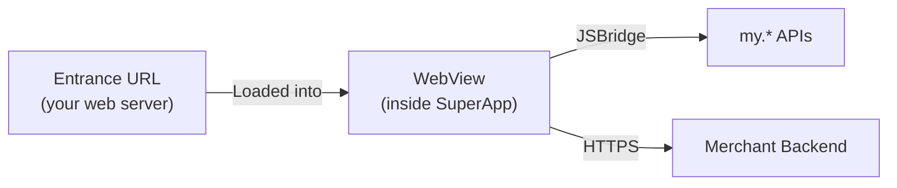

An H5 Mini App runs your web content inside a WebView within the Rebell SuperApp. There is no Mini Program framework, no IDE, and no build process required — just a hosted web page and a single `<script>` tag.

<Info>
H5 is the fastest path to deploying an existing mobile web app as a Mini App. It is ideal as a migration strategy or for content-driven experiences.
</Info>

## How It Works



- The SuperApp loads your web page at the configured **Entrance URL**
- Your page runs inside a managed **WebView**
- You access SuperApp capabilities through the **JSBridge SDK** — the same `my.*` namespace used by Native Mini Apps
- No quality review or build pipeline is required

## Step 1: Configure Your Entrance URL

In the Rebell developer portal, create an H5 Mini App and set the **Entrance URL** to your hosted web page:


```
https://your-domain.com/mini-app/index.html
```

Requirements:
- Must be **HTTPS**
- Must be accessible from mobile devices
- Domain must be whitelisted in your Mini App configuration

## Step 2: Add the JSBridge SDK

Include the JSBridge script in the `<head>` of your HTML page:

```html
<!DOCTYPE html>
<html>
<head>
  <meta charset="UTF-8" />
  <meta name="viewport" content="width=device-width, initial-scale=1.0" />
  <title>My Service</title>

  <!-- JSBridge SDK — must load before any my.* calls -->
  <script src="https://cdn.marmot-cloud.com/npm/hylid-bridge/2.10.0/index.js"></script>
</head>
<body>
  <!-- your content -->
</body>
</html>
```

Once loaded, the `my` object is available globally.

## Step 3: Detect the Environment

JSAPI calls only work inside the SuperApp WebView. Detect the environment before using `my.*`:

```javascript
function isInsideSuperApp() {
  return /MiniProgram/.test(navigator.userAgent);
}

if (isInsideSuperApp()) {
  // Safe to call my.* APIs
  my.getSystemInfo({
    success: (res) => console.log('Platform:', res.platform),
  });
} else {
  // Running in a regular browser — use fallback behavior
  console.log('Running in browser, JSAPI unavailable');
}
```

<Warning>
`my.JSBridge` is a reserved object and cannot be overridden. `console.log` also cannot be replaced inside the Mini App runtime.
</Warning>

## Step 4: Use JSAPI

All JSAPI calls follow the same callback pattern:

```javascript
my.apiName({
  // parameters
  success(res) { /* called on success */ },
  fail(err)    { /* called on failure */ },
  complete(res){ /* always called */    },
});
```

<Warning>
H5 Mini Apps support only a **subset** of the JSAPI available to Native Mini Apps. APIs that depend on the Mini Program runtime (e.g., page routing, custom components, worker threads) are not available inside a WebView.
</Warning>

### Supported APIs

<AccordionGroup>
  <Accordion title="Basic">
    | API | Description |
    |-----|-------------|
    | `my.getRunScene` | Get the launch scene of the Mini App |
  </Accordion>

  <Accordion title="UI — Navigation Bar">
    | API |
    |-----|
    | `my.showNavigationBarLoading` |
    | `my.hideNavigationBarLoading` |
    | `my.setNavigationBar` |
  </Accordion>

  <Accordion title="UI — Feedback & Dialogs">
    | API |
    |-----|
    | `my.alert` |
    | `my.confirm` |
    | `my.prompt` |
    | `my.showLoading` |
    | `my.hideLoading` |
    | `my.showToast` |
    | `my.hideToast` |
    | `my.showActionSheet` |
  </Accordion>

  <Accordion title="UI — Input & Display">
    | API | Description |
    |-----|-------------|
    | `my.choosePhoneContact` | Select a contact from the phone book |
    | `my.datePicker` | Open a native date picker |
    | `my.hideKeyboard` | Dismiss the soft keyboard |
    | `my.multiLevelSelect` | Multi-level cascading selector |
    | `my.setBackgroundColor` | Set the window background color |
    | `my.setCanPullDown` | Enable or disable pull-to-refresh |
  </Accordion>

  <Accordion title="Media — Image">
    | API |
    |-----|
    | `my.chooseImage` |
    | `my.previewImage` |
    | `my.saveImage` |
    | `my.getImageInfo` |
    | `my.compressImage` |
  </Accordion>

  <Accordion title="Media — Video">
    | API |
    |-----|
    | `my.chooseVideo` |
  </Accordion>

  <Accordion title="Storage">
    | API |
    |-----|
    | `my.getStorage` |
    | `my.setStorage` |
    | `my.removeStorage` |
    | `my.clearStorage` |
  </Accordion>

  <Accordion title="File Management">
    | API |
    |-----|
    | `my.saveFile` |
    | `my.getFileInfo` |
    | `my.getSavedFileInfo` |
    | `my.getSavedFileList` |
    | `my.removeSavedFile` |
    | `my.chooseFileFromDisk` |
    | `my.openDocument` |
  </Accordion>

  <Accordion title="Location & Maps">
    | API |
    |-----|
    | `my.getLocation` |
    | `my.openLocation` |
    | `my.chooseLocation` |
    | `my.calculateRoute` |
  </Accordion>

  <Accordion title="Network">
    | API |
    |-----|
    | `my.request` |
    | `my.uploadFile` |
    | `my.downloadFile` |
  </Accordion>

  <Accordion title="Device">
    | API |
    |-----|
    | `my.getSystemInfo` |
    | `my.getNetworkType` |
    | `my.getClipboard` |
    | `my.setClipboard` |
    | `my.watchShake` |
    | `my.onAccelerometerChange` |
    | `my.offAccelerometerChange` |
    | `my.onCompassChange` |
    | `my.offCompassChange` |
    | `my.vibrateShort` |
    | `my.vibrateLong` |
    | `my.makePhoneCall` |
    | `my.setScreenBrightness` |
    | `my.getScreenBrightness` |
    | `my.setKeepScreenOn` |
    | `my.getScreenOrientation` |
    | `my.setScreenOrientation` |
    | `my.scan` |
    | `my.getBatteryInfo` |
    | `my.addPhoneContact` |
    | `my.getSetting` |
    | `my.openSetting` |
    | `my.showAuthGuide` |
  </Accordion>

  <Accordion title="Biometric Authentication">
    | API |
    |-----|
    | `my.checkLocalBioAuthSupported` |
    | `my.startLocalBioAuth` |
  </Accordion>

  <Accordion title="Sharing & Mini App Navigation">
    | API |
    |-----|
    | `my.showSharePanel` |
    | `my.navigateToMiniProgram` |
    | `my.navigateBackMiniProgram` |
  </Accordion>

  <Accordion title="Auth & Payment">
    | API |
    |-----|
    | `my.getAuthCode` |
    | `my.tradePay` |
  </Accordion>

</AccordionGroup>

### Usage Examples

<AccordionGroup>
  <Accordion title="Get auth code for user identity">
    ```javascript
    my.getAuthCode({
      success: (res) => {
        // Send res.authCode to your backend to identify the user
        fetch('/api/login', {
          method: 'POST',
          body: JSON.stringify({ authCode: res.authCode }),
        });
      },
    });
    ```
  </Accordion>

  <Accordion title="Show native alerts and toasts">
    ```javascript
    // Native alert dialog
    my.alert({
      title: 'Order Placed',
      content: 'Your order has been confirmed.',
      buttonText: 'OK',
    });

    // Native toast
    my.showToast({
      content: 'Saved!',
      type: 'success',
      duration: 2000,
    });
    ```
  </Accordion>

  <Accordion title="Trigger a payment">
    ```javascript
    // tradeNO must come from your backend
    my.tradePay({
      tradeNO: '<payment reference from your backend>',
      success: (res) => {
        if (res.resultCode === '9000') {
          window.location.href = '/success';
        }
      },
      fail: (err) => {
        my.alert({ title: 'Payment failed', content: err.errorMessage });
      },
    });
    ```
  </Accordion>

  <Accordion title="Set the navigation bar title">
    ```javascript
    my.setNavigationBar({
      title: 'Checkout',
    });
    ```
  </Accordion>
</AccordionGroup>

## Step 5: Handle Payments

Payment flow in an H5 Mini App:

<Steps>
  <Step title="User taps Pay">
    User initiates payment from your web page
  </Step>
  <Step title="Call your backend">
    Your page sends order details to your backend via `fetch` or `XMLHttpRequest`
  </Step>
  <Step title="Backend creates payment">
    Your backend calls the Rebell Payment API and returns a `tradeNO`
  </Step>
  <Step title="Call my.tradePay">
    Pass the `tradeNO` to `my.tradePay` — Rebell handles the rest
  </Step>
  <Step title="Handle result">
    On success, redirect or update the page. Your backend also receives a webhook.
  </Step>
</Steps>

```javascript
async function initiatePayment(orderData) {
  // 1. Create payment on your backend
  const response = await fetch('/api/payment/create', {
    method: 'POST',
    headers: { 'Content-Type': 'application/json' },
    body: JSON.stringify(orderData),
  });
  const { tradeNO } = await response.json();

  // 2. Open Rebell payment UI
  my.tradePay({
    tradeNO,
    success: (res) => {
      if (res.resultCode === '9000') {
        window.location.href = '/order/success';
      } else {
        showError('Payment was not completed');
      }
    },
    fail: (err) => showError(err.errorMessage),
  });
}
```

## Limitations vs. Native

H5 Mini Apps have a narrower set of available APIs compared to Native:

| Capability | Native | H5 |
|---|---|---|
| Full JSAPI access | ✅ | Partial |
| Payment (`my.tradePay`) | ✅ | ✅ |
| Auth code | ✅ | ✅ |
| Native navigation | ✅ | Limited |
| Platform UI components | ✅ | ❌ |
| WebView access | Via component | Runs inside one |

<Tip>
If you need deeper SuperApp integration or native UI components, consider migrating to a **Native Mini App**.
</Tip>

## Testing

H5 Mini Apps can be tested directly:

1. Configure your Entrance URL to point to a **sandbox or staging** version of your page
2. Open the Mini App from within the Rebell SuperApp (sandbox)
3. Inspect behavior in browser DevTools when running locally — JSAPI calls will silently fail outside the SuperApp
4. Use `isInsideSuperApp()` to provide a fallback experience during development

## Next Steps

<CardGroup cols={2}>
  <Card title="JSAPI Reference" icon="code" href="/jsapi/reference">
    Full list of my.* APIs and their parameters
  </Card>
<Card title="Payments" icon="credit-card" href="/mini-app/payments">
    Complete guide to triggering payments from Mini Apps
  </Card>
  <Card title="Backend Authentication" icon="shield-halved" href="/mini-app/backend-authentication">
    Exchange auth codes for user identity on your backend
  </Card>
</CardGroup>
