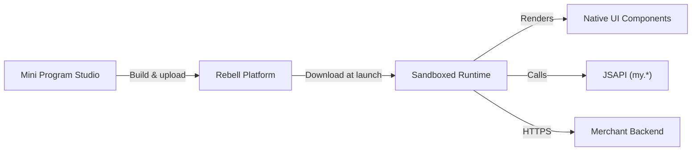

Native Mini Apps are built using the **Rebell Mini Program framework** — a component-based, JavaScript-driven approach that renders using platform-native UI elements inside the SuperApp.

<Note>
  **Mini Program Studio** is available for download in your personal area.

  
</Note>

<Info>
This is the recommended approach for new Mini App development. It provides the best performance, deepest SuperApp integration, and full access to all JSAPIs.
</Info>

## How It Works



- Code is written in **AXML** (markup), **ACSS** (styles), and **JavaScript**
- Rendered using **platform-native components** — not a WebView
- All JSAPI methods are available via the `my` global object
- Communication with your backend goes through standard HTTPS calls

## Project Structure

A minimal Native Mini App has this layout:

```
my-mini-app/
├── app.js          # App-level logic and lifecycle hooks
├── app.json        # Global configuration (pages, window, tabBar)
├── app.acss        # Global styles
└── pages/
    └── index/
        ├── index.axml   # Page template
        ├── index.js     # Page logic
        ├── index.json   # Page-level config
        └── index.acss   # Page styles
```

## Step 1: Install Mini Program Studio

Download and install **Mini Program Studio** from the Rebell developer portal.

After installation, log in with your merchant credentials and select your Mini App from the project list.

## Step 2: Create Your App Entry Point

**`app.js`** — defines global state and lifecycle hooks:

```javascript
App({
  onLaunch(options) {
    // Called once when the Mini App is first launched
    console.log('App launched', options);
  },

  onShow(options) {
    // Called when the Mini App becomes visible
  },

  onHide() {
    // Called when the Mini App goes to background
  },

  globalData: {
    userId: null,
  },
});
```

**`app.json`** — declares pages and global window settings:

```json
{
  "pages": [
    "pages/index/index"
  ],
  "window": {
    "defaultTitle": "My Service"
  }
}
```

## Step 3: Build a Page

**`pages/index/index.axml`** — page template:

```xml
<view class="container">
  <text class="title">{{title}}</text>
  <button type="primary" onTap="handlePay">Pay Now</button>
</view>
```

**`pages/index/index.js`** — page logic:

```javascript
Page({
  data: {
    title: 'Welcome',
  },

  onLoad(query) {
    // Page loaded, query contains URL params
  },

  handlePay() {
    // Request payment token from your backend, then trigger payment
    my.tradePay({
      paymentString: '<token from your backend>',
      success: (res) => {
        if (res.resultCode === '9000') {
          my.alert({ title: 'Payment successful' });
        }
      },
      fail: (err) => {
        my.alert({ title: 'Payment failed', content: err.errorMessage });
      },
    });
  },
});
```

**`pages/index/index.acss`** — page styles:

```css
.container {
  padding: 24px;
}

.title {
  font-size: 20px;
  font-weight: bold;
}
```

## Step 4: Access JSAPI

All platform capabilities are accessed via the `my` global object. Examples:

<AccordionGroup>
  <Accordion title="Get user identity (auth code)">
    ```javascript
    my.getAuthCode({
      success: (res) => {
        const authCode = res.authCode;
        // Send authCode to your backend to exchange for user token
      },
      fail: (err) => console.error(err),
    });
    ```
  </Accordion>

  <Accordion title="Show a loading indicator">
    ```javascript
    my.showLoading({ content: 'Processing...' });

    // Later:
    my.hideLoading();
    ```
  </Accordion>

  <Accordion title="Navigate to another page">
    ```javascript
    my.navigateTo({ url: '/pages/confirm/index?orderId=123' });
    ```
  </Accordion>

  <Accordion title="Get device info">
    ```javascript
    my.getSystemInfo({
      success: (res) => {
        console.log(res.platform); // 'iOS' or 'Android'
      },
    });
    ```
  </Accordion>
</AccordionGroup>

See the full [JSAPI Reference](/jsapi/reference) for all available methods.

## Step 5: Call Your Backend

Use `my.request` for HTTPS calls to your merchant backend:

```javascript
my.request({
  url: 'https://api.your-backend.com/order/create',
  method: 'POST',
  headers: { 'Content-Type': 'application/json' },
  data: { amount: 1000, currency: 'EUR' },
  success: (res) => {
    const { paymentString } = res.data;
    // Use paymentString to trigger my.tradePay
  },
  fail: (err) => my.alert({ title: 'Network error' }),
});
```

<Warning>
Never call Rebell Payment APIs directly from the Mini App. All payment creation must go through your merchant backend to protect your signing credentials.
</Warning>

## Step 6: Preview and Test

In Mini Program Studio:

1. Click **Preview** to generate a QR code
2. Scan with the Rebell SuperApp (sandbox mode) to run on device
3. Use the built-in **Simulator** for quick iteration without a physical device
4. Check the **Console** tab for logs and errors

## Step 7: Submit for Review

Once ready:

1. Increment the version in `app.json`
2. Click **Upload** in Mini Program Studio
3. Submit the uploaded version for Rebell review from the developer portal
4. After approval, publish to production

## Payments

Triggering a payment from a Native Mini App follows this flow:

<Steps>
  <Step title="User initiates action">
    User taps a button or completes a form in your Mini App
  </Step>
  <Step title="Mini App calls your backend">
    Send order details to your backend via `my.request`
  </Step>
  <Step title="Backend creates payment">
    Your backend calls the Rebell Payment API (e.g. `tradePay`) and receives a `paymentString`
  </Step>
  <Step title="Mini App opens payment UI">
    Pass `paymentString` to `my.tradePay` — Rebell handles the payment UI
  </Step>
  <Step title="Backend receives webhook">
    Rebell notifies your backend of the final result
  </Step>
</Steps>

See [Payments in Mini Apps](/mini-app/payments) for the complete implementation guide.

## Next Steps

<CardGroup cols={2}>
  <Card title="JSAPI Reference" icon="code" href="/jsapi/reference">
    Full list of available my.* APIs
  </Card>
  <Card title="Mini App Lifecycle" icon="rotate" href="/mini-app/lifecycle">
    Review, versioning, and publishing process
  </Card>
  <Card title="Backend Authentication" icon="shield-halved" href="/mini-app/backend-authentication">
    Authenticate Mini App requests on your backend
  </Card>
  <Card title="Payments" icon="credit-card" href="/mini-app/payments">
    Trigger payments from within your Mini App
  </Card>
</CardGroup>
